# Domain Modeling
** Domain modeling ** is the process of creating a conceptual model in code for a specific problem. A model describes the various entities, their attributes and behaviors, as well as the constraints that govern the problem domain.

## Model epic fails videos

the two essential metrics for gauging popularity are:
* An epic rating 

* whether or not the video has animals.

### Define a constructor and initialize properties


To define the same properties between many objects, you'll want to use a constructor function. Below is a table that summarizes a JavaScript representation of an EpicFailVideo object.


Here's an implementation of the EpicFailVideo constructor function.

```
var EpicFailVideo = function(epicRating, hasAnimals) {
  this.epicRating = epicRating;
  this.hasAnimals = hasAnimals;
}

var parkourFail = new EpicFailVideo(7, false);
var corgiFail = new EpicFailVideo(4, true);

console.log(parkourFail);
console.log(corgiFail);

```

## Generate random numbers

To model the random nature of user behavior, you'll need the help of a random number generator. Fortunately, the JavaScript standard library includes a Math.random() function for just this sort of occasion.

```
var EpicFailVideo = function(epicRating, hasAnimals) {
  this.epicRating = epicRating;
  this.hasAnimals = hasAnimals;
}

EpicFailVideo.prototype.generateRandom = function(min, max) {
  return Math.floor(Math.random() * (max - min + 1)) + min;
}

var parkourFail = new EpicFailVideo(7, false);
var corgiFail = new EpicFailVideo(4, true);

console.log(parkourFail.generateRandom(1, 5));
console.log(corgiFail.generateRandom(1, 5));
```

### Calculate daily Likes

#### viewers times percentage.


To calculate the number of viewers per day, generate a random number between 10 and 30 and then multiply it by the epic rating of that video.

Following code to calculate number of viewers.
```
var EpicFailVideo = function(epicRating, hasAnimals) {
  this.epicRating = epicRating;
  this.hasAnimals = hasAnimals;
}

EpicFailVideo.prototype.generateRandom = function(min, max) {
  return Math.floor(Math.random() * (max - min + 1)) + min;
}

EpicFailVideo.prototype.dailyLikes = function() {
  var viewers, percentage;

  viewers = this.generateRandom(10, 30) * this.epicRating;

  if (this.hasAnimals) {
    percentage = 0.75;
  } else {
    percentage = 0.40;
  }

  return Math.round(viewers * percentage);
}

var parkourFail = new EpicFailVideo(7, false);
var corgiFail = new EpicFailVideo(4, true);

console.log(parkourFail.dailyLikes());
console.log(corgiFail.dailyLikes());

```

### Here's some tips to follow when building your own domain models.

When modeling a single entity that'll have many instances, build self-contained objects with the same attributes and behaviors.
Model its attributes with a constructor function that defines and initializes properties.
Model its behaviors with small methods that focus on doing one job well.
Create instances using the new keyword followed by a call to a constructor function.
Store the newly created object in a variable so you can access its properties and methods from outside.
Use the this variable within methods so you can access the object's properties and methods from inside.


# Tables

It's represents information in a grid format. Examples of tables include financial reports, TV schedules, and sports results.

### Basic Table Structure

#### <table> 
The <table> element is used to create a table. The contents of the table are written out row by row

#### tr

You indicate the start of each
row using the opening <tr> tag. 

#### <td>
Each cell of a table is represented using a <td> element
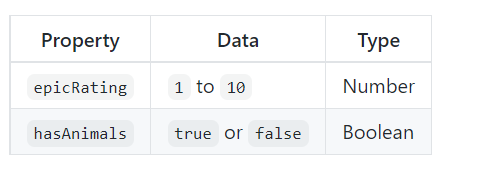
## Table heading

#### <th>
The <th> element is used just like the <td> element but its purpose is to represent the heading for either a column or a row. 

#### Long Tables

There are three elements that help distinguish between the main content of the table and the first and last rows  

### <thead>
The headings of the table should 
sit inside the <thead> element.

### <tbody>
The body should sit inside the <tbody> element.

### <tfoot>
The footer belongs inside the <tfoot> element.

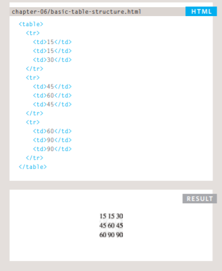

## SUMMARY

* The <table> element is used to add tables to a web page.

* A table is drawn out row by row. Each row is created with the <tr> element.

* Inside each row there are a number of cells  represented by the <td> element (or <th> if it is a header).

* You can make cells of a table span more than one row or column using the rowspan and colspan attributes.

* For long tables you can split the table into a <thead>,<tbody>, and <tfoot>.

## Functions, Methods, and Objects

## FUNCTIONS & METHODS

Generally speaking, a function is a "subprogram" that can be called by code external (or internal in the case of recursion) to the function. Like the program itself, a function is composed of a sequence of statements called the function body. Values can be passed to a function, and the function will return a value.

## Object
JavaScript is designed on a simple object-based paradigm. An object is a collection of properties, and a property is an association between a name (or key) and a value. A property's value can be a function, in which case the property is known as a method. In addition to objects that are predefined in the browser, you can define your own objects. This chapter describes how to use objects, properties, functions, and methods, and how to create your own objects.

## Methods
a shorter syntax for method definitions on objects initializers is introduced. It is a shorthand for a funct

## Declarating a function

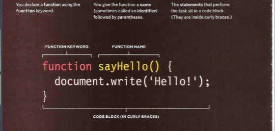

## Calling Function

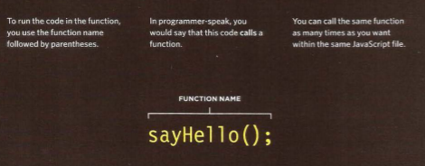

## Declaration Function That need information


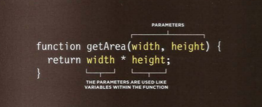

## Getting a single value out of a function

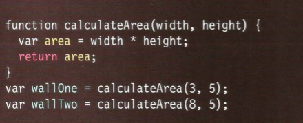

## Getting multiple values out of a function

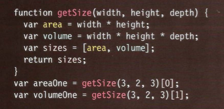


## IMMEDIATELY INVOKED FUNCTION EXPRESSIONS

This way of writing a function is used in several different situations.
Often functions are used to ensure that the variable names do not conflict
with each other

## WHEN TO USE ANONYMOUS FUNCTIONS AND llFES

They are used for code that only needs to run once within a task, rather than repeatedly being called by other parts of the script. For example:

* As an argument when a function is called(to calculate a value for that function).
* To assign the value of a property to an object.
* In event handlers and listeners to perform a task when an event occurs.
* To prevent conflicts between two scripts that might use the same variable names

## VARIABLE SCOPE 

The location where you declare a variable will affect where it can be used within your code. If you declare it within a function, it can only be used within that function. This is known as the variable's scope.


* LOCAL VARIABLES
The interpreter creates local variables when the function is run, and removes them as soon as the function has finished its task

* GLOBAL VARIABLES

Global variables are stored in memory for as long as the web page is loaded into the web browser. This means they take up more memory than local
variables.

## Creating an object

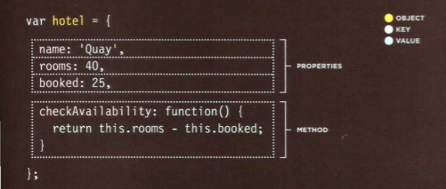

## Accessing an object and dot notation

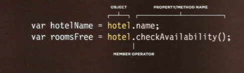

## Creating an object: constructor notation

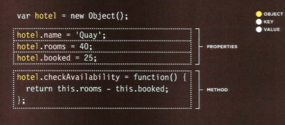

## Updating an object
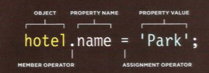


After read this page please visit [Quiz07](Quiz7.md) to test your information