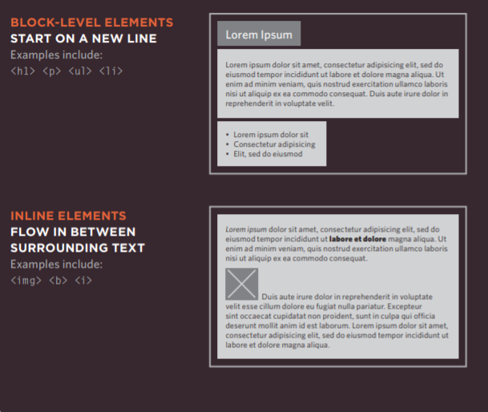
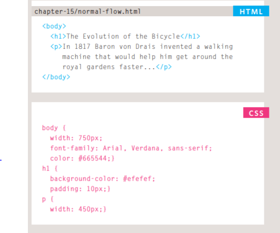
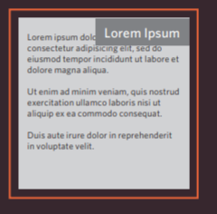
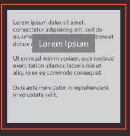
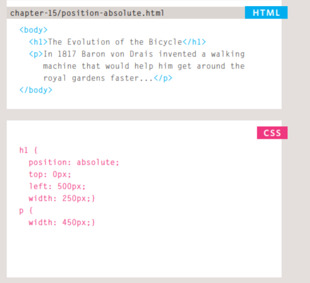
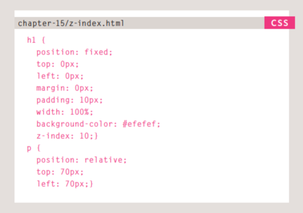
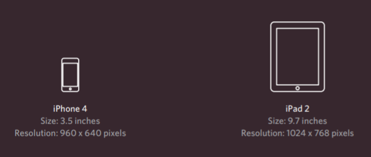

# Layout

#### Key Concepts in Positioning Elements
Building Blocks
 CSS treats each HTML element as if it is in its own box. This box will either be a block-level box or an inline box.
  Block-level boxes start on a new line and act as the main building blocks of any layout, while inline boxes flow between surrounding text. You can control how much space each box takes up by setting the width of the boxes (and sometimes the height, too). To separate boxes, you can use borders, margins, padding, and background colors.

## Controlling the Position of Elements

### Normal flow
Every block-level element appears on a new line, causing each item to appear lower down the page than the previous one.

### Relative Positioning
 This moves an element from the position it would be in normal flow, shifting it to the top, right, bottom, or left of where it would have been placed.

### Absolute positioning 
This positions the element in relation to its containing element. It is taken out of normal flow, meaning that it does not affect the position of any surrounding elements (as they simply ignore the space it would have taken up).

### Fixed Positioning 
This is a form of absolute positioning that positions the element in relation to the browser window, as opposed to the containing element.

### Normal Flow
#### position:static

In normal flow, each block-level element sits on top of the next one. Since this is the default way in which browsers treat HTML elements, you do not need a CSS property to indicate that elements should appear in normal flow, but the syntax would be:
 
## Relative Positioning
### position:relative

Relative positioning moves an element in relation to where it would have been in normal flow.

## position:absolute

When the position property is given a value of absolute, the box is taken out of normal flow and no longer affects the position of other elements on the page.

## position:fixed
Fixed positioning is a type of absolute positioning that requires the position property to have a value of fixed.

## z-index
 When you use relative, fixed, or absolute positioning, boxes can overlap. If boxes do overlap, the elements that appear later in the HTML code sit on top of those that are earlier in the page.

### Float

The float property allows you to take an element in normal flow and place it as far to the left or right of the containing element as possible.

## Using Float to Place Elements Side-by-Side

A lot of layouts place boxes next to each other. The float property is commonly used to achieve this. When elements are floated, the height of the boxes can affect where the following elements sit.

## Clearing Floats
### clear
The clear property allows you to say that no element (within the same containing element) should touch the left or righthand sides of a box. It can take the following values:
### left 
 The left-hand side of the box should not touch any other elements appearing in the same containing element. 
 ### right
 The right-hand side of the box will not touch elements appearing in the same containing element. 
 ### both
  Neither the left nor right-hand sides of the box will touch elements appearing in the same containing element. 
  ### none
   Elements can touch either side.
   

## Creating Multi-Column Layouts with Floats

Many web pages use multiple columns in their design. This is achieved by using a 
 element to represent each column. The following three CSS properties are used to position the columns next to each other:
### width
 This sets the width of the columns. 
 ### float 
 This positions the columns next to each other. 
 
 ### margin
  This creates a gap between the columns.

  

  ### Screen Sizes
  Different visitors to your site will have different sized screens that show different amounts of information, so your design needs to be able to work on a range of different sized screens.

### Screen Resolution
Resolution refers to the number of dots a screen shows per inch. Some devices have a higher resolution than desktop computers and most operating systems allow users to adjust the resolution of their screens.

After finish reading pleas click [here](Quiz08.md) to check your information