# CREATE STUNNING ANIMATED CHARTS 

Charts are far better for displaying data visually than tables and have the added benefit that no one is ever going to press-gang them into use as a layout tool. They’re easier to look at and convey data quickly, but they’re not always easy to create.

### Setting up

 [download Chart.js](https://github.com/nnnick/Chart.js)

 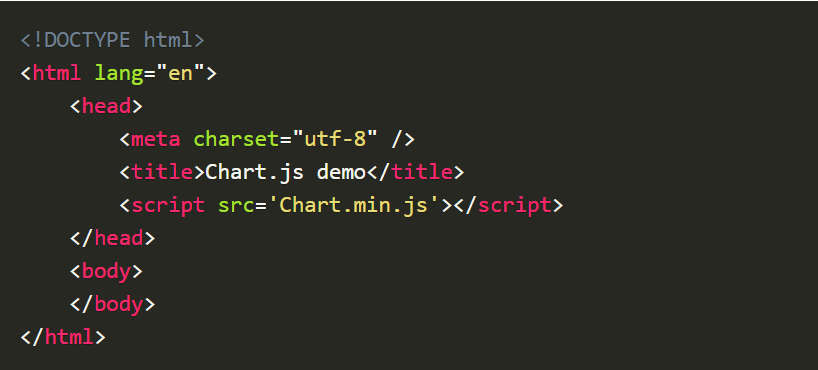

 ## Drawing a line chart

 add this to the body of our HTML page:

  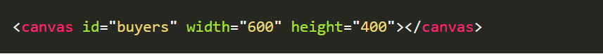

  Next, we need to write a script that will retrieve the context of the canvas, so add this to the foot of your body element:
   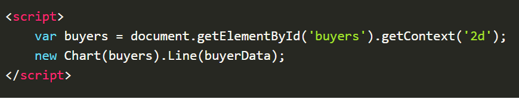

   Inside the same script tags we need to create our data, in this instance it’s an object that contains labels for the base of our chart and datasets to describe the values on the chart. Add this immediately above the line that begins ‘var buyers=’:
   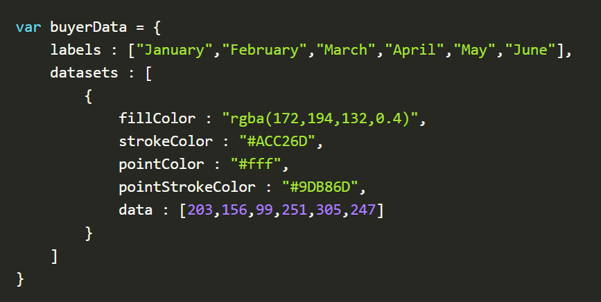

   ## Drawing a pie chart
   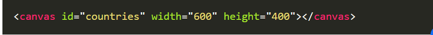

   we need to get the context and to instantiate the chart:
   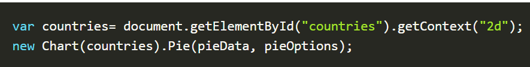

   Next we need to create the data. This data is a little different to the line chart because the pie chart is simpler, we just need to supply a value and a color for each section:

   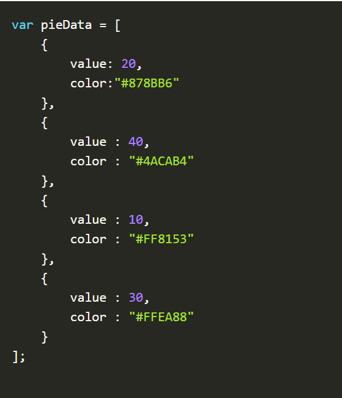

add our options:
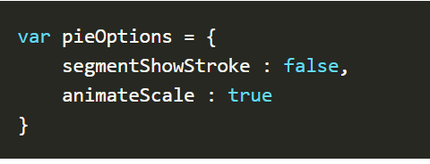


## Drawing a bar chart

First, we add the canvas element:
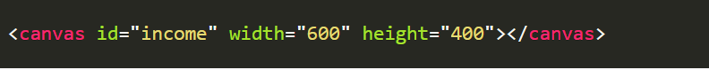

Next, we retrieve the element and create the graph:
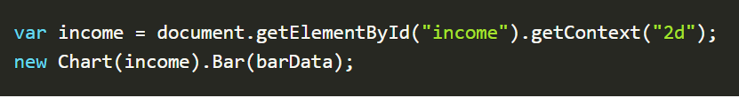

And finally, we add in the bar chart’s data:

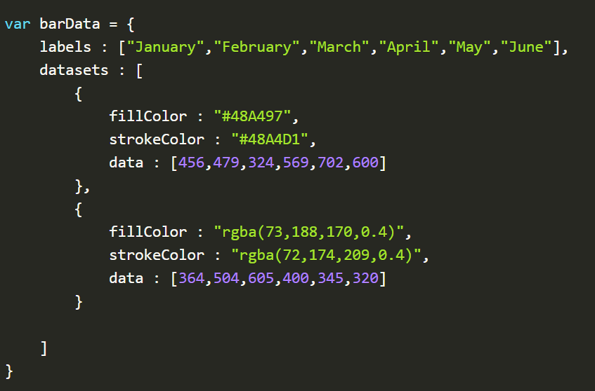

## Conclusion
You can view [a demo of this in action here](https://www.webdesignerdepot.com/cdn-origin/uploads7/easily-create-stunning-animated-charts-with-chart-js/chartjs-demo.html).


# Chart.js

You can get the latest version of Chart.js from [npm](https://npmjs.com/package/chart.js)

### Creating a Chart

It's easy to get started with Chart. js. All that's required is the script included in your page along with a single 'canvas' node to render the chart.

n this example,they create a bar chart for a single dataset and render that in our page.
```
<canvas id="myChart" width="400" height="400"></canvas>
<script>
var ctx = document.getElementById('myChart').getContext('2d');
var myChart = new Chart(ctx, {
    type: 'bar',
    data: {
        labels: ['Red', 'Blue', 'Yellow', 'Green', 'Purple', 'Orange'],
        datasets: [{
            label: '# of Votes',
            data: [12, 19, 3, 5, 2, 3],
            backgroundColor: [
                'rgba(255, 99, 132, 0.2)',
                'rgba(54, 162, 235, 0.2)',
                'rgba(255, 206, 86, 0.2)',
                'rgba(75, 192, 192, 0.2)',
                'rgba(153, 102, 255, 0.2)',
                'rgba(255, 159, 64, 0.2)'
            ],
            borderColor: [
                'rgba(255, 99, 132, 1)',
                'rgba(54, 162, 235, 1)',
                'rgba(255, 206, 86, 1)',
                'rgba(75, 192, 192, 1)',
                'rgba(153, 102, 255, 1)',
                'rgba(255, 159, 64, 1)'
            ],
            borderWidth: 1
        }]
    },
    options: {
        scales: {
            y: {
                beginAtZero: true
            }
        }
    }
});
</script>

```


## Basic usage of canvas
```
<canvas id="tutorial" width="150" height="150"></canvas>

```

At first sight a 'canvas' looks like the 'img' element, with the only clear difference being that it doesn't have the src and alt attributes. Indeed, the 'canvas' element has only two attributes, width and height. These are both optional and can also be set using DOM properties. When no width and height attributes are specified, the canvas will initially be 300 pixels wide and 150 pixels high. The element can be sized arbitrarily by CSS, but during rendering the image is scaled to fit its layout size: if the CSS sizing doesn't respect the ratio of the initial canvas, it will appear distorted.

Fallback content

Providing fallback content is very straightforward: just insert the alternate content inside the "canvas" element. Browsers that don't support "canvas" will ignore the container and render the fallback content inside it. Browsers that do support "canvas" will ignore the content inside the container, and just render the canvas normally.

for example
```
<canvas id="stockGraph" width="150" height="150">
  current stock price: $3.15 + 0.15
</canvas>

<canvas id="clock" width="150" height="150">
  
</canvas>

```
Required "/canvas" tag

As a consequence of the way fallback is provided, unlike the "img" element, the "canvas" element requires the closing tag ("/canvas"). If this tag is not present, the rest of the document would be considered the fallback content and wouldn't be displayed.

## The rendering context

The canvas is initially blank. To display something, a script first needs to access the rendering context and draw on it. The "canvas" element has a method called getContext(), used to obtain the rendering context and its drawing functions. getContext() takes one parameter, the type of context. 
```
var canvas = document.getElementById('tutorial');
var ctx = canvas.getContext('2d');

```

## Checking for support
The fallback content is displayed in browsers which do not support "canvas". Scripts can also check for support programmatically by testing for the presence of the getContext() method. Our code snippet from above becomes something like this:
```
var canvas = document.getElementById('tutorial');

if (canvas.getContext) {
  var ctx = canvas.getContext('2d');
  // drawing code here
} else {
  // canvas-unsupported code here
}

```
## A skeleton template
Here is a minimalistic template, which we'll be using as a starting point for later examples.

```
<!DOCTYPE html>
<html>
  <head>
    <meta charset="utf-8"/>
    <title>Canvas tutorial</title>
    <script type="text/javascript">
      function draw() {
        var canvas = document.getElementById('tutorial');
        if (canvas.getContext) {
          var ctx = canvas.getContext('2d');
        }
      }
    </script>
    <style type="text/css">
      canvas { border: 1px solid black; }
    </style>
  </head>
  <body onload="draw();">
    <canvas id="tutorial" width="150" height="150"></canvas>
  </body>
</html>

```

# Drawing shapes with canvas

## The grid
Before we can start drawing, we need to talk about the canvas grid or coordinate space.

## Drawing rectangles

First let's look at the rectangle. There are three functions that draw rectangles on the canvas:

* fillRect(x, y, width, height)
Draws a filled rectangle.
* strokeRect(x, y, width, height)
Draws a rectangular outline.
* clearRect(x, y, width, height)
Clears the specified rectangular area, making it fully transparent.


Rectangular shape example
```
function draw() {
  var canvas = document.getElementById('canvas');
  if (canvas.getContext) {
    var ctx = canvas.getContext('2d');

    ctx.fillRect(25, 25, 100, 100);
    ctx.clearRect(45, 45, 60, 60);
    ctx.strokeRect(50, 50, 50, 50);
  }
}
```

## Drawing paths

Here are the functions used to perform these steps:

* beginPath()
Creates a new path. Once created, future drawing commands are directed into the path and used to build the path up.
* Path methods
Methods to set different paths for objects.
* closePath()
Adds a straight line to the path, going to the start of the current sub-path.
* stroke()
Draws the shape by stroking its outline.
* fill()
Draws a solid shape by filling the path's content area.

## Drawing a triangle
For example, the code for drawing a triangle would look something like this:
```
function draw() {
  var canvas = document.getElementById('canvas');
  if (canvas.getContext) {
    var ctx = canvas.getContext('2d');

    ctx.beginPath();
    ctx.moveTo(75, 50);
    ctx.lineTo(100, 75);
    ctx.lineTo(100, 25);
    ctx.fill();
  }
}
```

### Lines
For drawing straight lines, use the lineTo() method.

* lineTo(x, y)
Draws a line from the current drawing position to the position specified by x and y.
This method takes two arguments, x and y, which are the coordinates of the line's end point. 

```
function draw() {
  var canvas = document.getElementById('canvas');
  if (canvas.getContext) {
    var ctx = canvas.getContext('2d');

    // Filled triangle
    ctx.beginPath();
    ctx.moveTo(25, 25);
    ctx.lineTo(105, 25);
    ctx.lineTo(25, 105);
    ctx.fill();

    // Stroked triangle
    ctx.beginPath();
    ctx.moveTo(125, 125);
    ctx.lineTo(125, 45);
    ctx.lineTo(45, 125);
    ctx.closePath();
    ctx.stroke();
  }
}


```

## Arcs
To draw arcs or circles, we use the arc() or arcTo() methods.

* arc(x, y, radius, startAngle, endAngle, counterclockwise)
Draws an arc which is centered at (x, y) position with radius r starting at startAngle and ending at endAngle.

* arcTo(x1, y1, x2, y2, radius)
Draws an arc with the given control points and radius, connected to the previous point by a straight line.

```
Arcs
To draw arcs or circles, we use the arc() or arcTo() methods.

arc(x, y, radius, startAngle, endAngle, counterclockwise)
Draws an arc which is centered at (x, y) position with radius r starting at startAngle and ending at endAngle going in the given direction indicated by counterclockwise (defaulting to clockwise).
arcTo(x1, y1, x2, y2, radius)
Draws an arc with the given control points and radius, connected to the previous point by a straight line.
```

## Using SVG paths

Another powerful feature of the new canvas Path2D API is using SVG path data to initialize paths on your canvas. This might allow you to pass around path data and re-use them in both, SVG and canvas.
```
var p = new Path2D('M10 10 h 80 v 80 h -80 Z');
```


# Applying styles and colors

## Colors
Up until now we have only seen methods of the drawing context. If we want to apply colors to a shape, there are two important properties we can use: 

* fillStyle = color
Sets the style used when filling shapes.
* strokeStyle = color
Sets the style for shapes' outlines.

```
// these all set the fillStyle to 'orange'

ctx.fillStyle = 'orange';
ctx.fillStyle = '#FFA500';
ctx.fillStyle = 'rgb(255, 165, 0)';
ctx.fillStyle = 'rgba(255, 165, 0, 1)';


```

## Transparency
In addition to drawing opaque shapes to the canvas, we can also draw semi-transparent shapes.

* globalAlpha = transparencyValue
Applies the specified transparency value to all future shapes drawn on the canvas. The value must be between 0.0 (fully transparent) to 1.0 (fully opaque). This value is 1.0 (fully opaque) by default.

```
// Assigning transparent colors to stroke and fill style

ctx.strokeStyle = 'rgba(255, 0, 0, 0.5)';
ctx.fillStyle = 'rgba(255, 0, 0, 0.5)';

```

## Line styles
There are several properties which allow us to style lines.

* lineWidth = value
Sets the width of lines drawn in the future.
* lineCap = type
Sets the appearance of the ends of lines.
* lineJoin = type
Sets the appearance of the "corners" where lines meet.
* miterLimit = value
Establishes a limit on the miter when two lines join at a sharp angle, to let you control how thick the junction becomes.
* getLineDash()
Returns the current line dash pattern array containing an even number of non-negative numbers.

* setLineDash(segments)
Sets the current line dash pattern.
* lineDashOffset = value
Specifies where to start a dash array on a line.

```
function draw() {
  var ctx = document.getElementById('canvas').getContext('2d');
  for (var i = 0; i < 10; i++) {
    ctx.lineWidth = 1 + i;
    ctx.beginPath();
    ctx.moveTo(5 + i * 14, 5);
    ctx.lineTo(5 + i * 14, 140);
    ctx.stroke();
  }
}

```

## Gradients

* createLinearGradient(x1, y1, x2, y2)
Creates a linear gradient object with a starting point of (x1, y1) and an end point of (x2, y2).
* createRadialGradient(x1, y1, r1, x2, y2, r2)
Creates a radial gradient. The parameters represent two circles, one with its center at (x1, y1) and a radius of r1, and the other with its center at (x2, y2) with a radius of r2.
* createConicGradient(angle, x, y)
Creates a conic gradient object with a starting angle of angle in radians, at the position (x, y).

```
function draw() {
  var ctx = document.getElementById('canvas').getContext('2d');

  // Create gradients
  var lingrad = ctx.createLinearGradient(0, 0, 0, 150);
  lingrad.addColorStop(0, '#00ABEB');
  lingrad.addColorStop(0.5, '#fff');
  lingrad.addColorStop(0.5, '#26C000');
  lingrad.addColorStop(1, '#fff');

  var lingrad2 = ctx.createLinearGradient(0, 50, 0, 95);
  lingrad2.addColorStop(0.5, '#000');
  lingrad2.addColorStop(1, 'rgba(0, 0, 0, 0)');

  // assign gradients to fill and stroke styles
  ctx.fillStyle = lingrad;
  ctx.strokeStyle = lingrad2;

  // draw shapes
  ctx.fillRect(10, 10, 130, 130);
  ctx.strokeRect(50, 50, 50, 50);

}

```
## Patterns

The type specifies how to use the image in order to create the pattern, and must be one of the following string values:

* repeat
Tiles the image in both vertical and horizontal directions.
* repeat-x
Tiles the image horizontally but not vertically.
* repeat-y
Tiles the image vertically but not horizontally.
* no-repeat
Doesn't tile the image. It's used only once.

## Drawing text

The canvas rendering context provides two methods to render text:

* fillText(text, x, y [, maxWidth])
Fills a given text at the given (x,y) position. Optionally with a maximum width to draw.
* strokeText(text, x, y [, maxWidth])
Strokes a given text at the given (x,y) position. Optionally with a maximum width to draw.

## Styling text

* font = value
The current text style being used when drawing text. This string uses the same syntax as the CSS font property. The default font is 10px sans-serif.
* textAlign = value
Text alignment setting. Possible values: start, end, left, right or center. The default value is start.
* textBaseline = value
Baseline alignment setting. Possible values: top, hanging, middle, alphabetic, ideographic, bottom. The default value is alphabetic.
* direction = value
Directionality. Possible values: ltr, rtl, inherit. The default value is inherit.

after reading this page go [here](Quiz12.md) to test your information