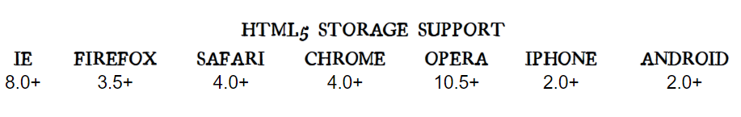
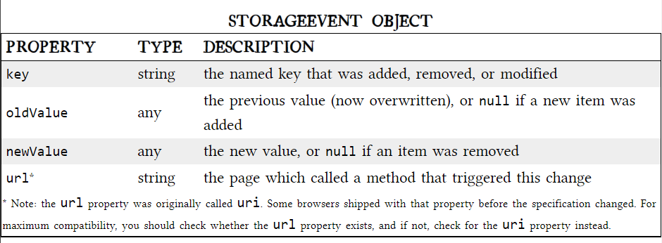

# THE PAST, PRESENT & FUTURE OF LOCAL STORAGE FOR WEB APPLICATIONS

## DIVING IN
If your native client application needs local storage beyond key/value pairs, you can embed your own database, invent your own file format, or any number of other solutions.

Historically, web applications have had none of these luxuries. Cookies were invented early in the web’s history, and indeed they can be used for persistent local storage of small amounts of data. But they have three potentially dealbreaking downsides:

* Cookies are included with every HTTP request, thereby slowing down your web application by needlessly transmitting the same data over and over

* Cookies are included with every HTTP request, thereby sending data unencrypted over the internet (unless your entire web application is served over SSL)

* Cookies are limited to about 4 KB of data — enough to slow down your application (see above), but not enough to be terribly useful

* What we really want is:
* a lot of storage space
* on the client
* that persists beyond a page refresh
* and isn’t transmitted to the server

## INTRODUCING HTML5 STORAGE

* what is HTML5 Storage? Simply put, it’s a way for web pages to store named key/value pairs locally, within the client web browser. Like cookies, this data persists even after you navigate away from the web site, close your browser tab, exit your browser, or what have you. Unlike cookies, this data is never transmitted to the remote web server (unless you go out of your way to send it manually). Unlike all previous attempts at providing persistent local storage, it is implemented natively in web browsers, so it is available even when third-party browser plugins are not.

* Which browsers? Well, the latest version of pretty much every browser supports HTML5 Storage… even Internet Explorer!



From your JavaScript code, you’ll access HTML5 Storage through the localStorage object on the global window object. Before you can use it, you should detect whether the browser supports it.

* check for HTML5 Storage
```

function supports_html5_storage() {
  try {
    return 'localStorage' in window && window['localStorage'] !== null;
  } catch (e) {
    return false;
  }
}
```
Instead of writing this function yourself, you can use Modernizr to detect support for HTML5 Storage.
```
if (Modernizr.localstorage) {
  // window.localStorage is available!
} else {
  // no native support for HTML5 storage :(
  // maybe try dojox.storage or a third-party solution
}
```
## USING HTML5 STORAGE

HTML5 Storage is based on named key/value pairs. You store data based on a named key, then you can retrieve that data with the same key. The named key is a string. The data can be any type supported by JavaScript, including strings, Booleans, integers, or floats. However, the data is actually stored as a string.

If you are storing and retrieving anything other than strings, you will need to use functions like parseInt() or parseFloat() to coerce your retrieved data into the expected JavaScript datatype.
```
interface Storage {
  getter any getItem(in DOMString key);
  setter creator void setItem(in DOMString key, in any data);
};
```

* Calling setItem() with a named key that already exists will silently overwrite the previous value. 
* Calling getItem() with a non-existent key will return null rather than throw an exception.

 you can simply use square brackets. For example, this snippet of code:

```
var foo = localStorage.getItem("bar");
// ...
localStorage.setItem("bar", foo);
```

…could be rewritten to use square bracket syntax instead:
```
var foo = localStorage["bar"];
// ...
localStorage["bar"] = foo;
```
* Calling removeItem() with a non-existent key will do nothing.

Finally, there is a property to get the total number of values in the storage area, and to iterate through all of the keys by index (to get the name of each key).
```
interface Storage {
  readonly attribute unsigned long length;
  getter DOMString key(in unsigned long index);
  ```

  ## TRACKING CHANGES TO THE HTML5 STORAGE AREA

   Trapping the storage event works the same as every other event you’ve ever trapped. If you prefer to use jQuery or some other JavaScript library to register your event handlers, you can do that with the storage event, too.)
   ```
if (window.addEventListener) {
  window.addEventListener("storage", handle_storage, false);
} else {
  window.attachEvent("onstorage", handle_storage);
};

   ```

 The handle_storage callback function will be called with a StorageEvent object, except in Internet Explorer where the event object is stored in window.event.

```
function handle_storage(e) {
  if (!e) { e = window.event; }
}  

```



## HTML5 STORAGE IN ACTION

```
function saveGameState() {
    if (!supportsLocalStorage()) { return false; }
    localStorage["halma.game.in.progress"] = gGameInProgress;
    for (var i = 0; i < kNumPieces; i++) {
	localStorage["halma.piece." + i + ".row"] = gPieces[i].row;
	localStorage["halma.piece." + i + ".column"] = gPieces[i].column;
    }
    localStorage["halma.selectedpiece"] = gSelectedPieceIndex;
    localStorage["halma.selectedpiecehasmoved"] = gSelectedPieceHasMoved;
    localStorage["halma.movecount"] = gMoveCount;
    return true;
}
```
restores values using the localStorage object.

```
function resumeGame() {
    if (!supportsLocalStorage()) { return false; }
    gGameInProgress = (localStorage["halma.game.in.progress"] == "true");
    if (!gGameInProgress) { return false; }
    gPieces = new Array(kNumPieces);
    for (var i = 0; i < kNumPieces; i++) {
	var row = parseInt(localStorage["halma.piece." + i + ".row"]);
	var column = parseInt(localStorage["halma.piece." + i + ".column"]);
	gPieces[i] = new Cell(row, column);
    }
    gNumPieces = kNumPieces;
    gSelectedPieceIndex = parseInt(localStorage["halma.selectedpiece"]);
    gSelectedPieceHasMoved = localStorage["halma.selectedpiecehasmoved"] == "true";
    gMoveCount = parseInt(localStorage["halma.movecount"]);
    drawBoard();
    return true;
}
```

after reading this page go [here](Quiz13.md) to test your information
