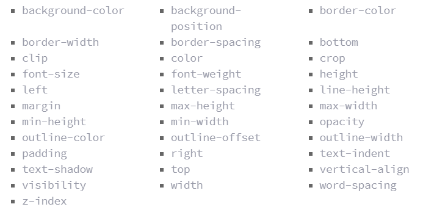

# What Google Learned From Its Quest to Build the Perfect Team


Like most 25-year-olds, Julia Rozovsky wasn’t sure what she wanted to do with her life. She had worked at a consulting firm, but it wasn’t a good match. Then she became a researcher for two professors at Harvard. All she knew for certain was that she wanted to find a job that was more social. 

She thought about various opportunities — Internet companies, a Ph.D. program — but nothing seemed exactly right. So in 2009, she chose the path that allowed her to put off making a decision: She applied to business schools and was accepted by the Yale School of Management.

Study groups have become a rite of passage at M.B.A. programs, a way for students to practice working in teams and a reflection of the increasing demand for employees who can adroitly navigate group dynamics. 

Every day, between classes or after dinner, Rozovsky and her four teammates gathered to discuss homework assignments, compare spreadsheets and strategize for exams. Everyone was smart and curious, and they had a lot in common: They had gone to similar colleges and had worked at analogous firms.

The team’s dynamics could put her on edge. When the group met, teammates sometimes jockeyed for the leadership position or criticized one another’s ideas. 

So Rozovsky started looking for other groups she could join. A classmate mentioned that some students were putting together teams for ‘‘case competitions,’’ contests in which participants proposed solutions to real-world business problems that were evaluated by judges, who awarded trophies and cash.

It always struck Rozovsky as odd that her experiences with the two groups were dissimilar. Each was composed of people who were bright and outgoing. When she talked one on one with members of her study group, the exchanges were friendly and warm. It was only when they gathered as a team that things became fraught.

## Our data-saturated 
age enables us to examine our work habits and office quirks with a scrutiny that our cubicle-bound forebears could only dream of. 

# Project Aristotle’s researchers 
began by reviewing a half-century of academic studies looking at how teams worked.

No matter how researchers arranged the data, though, it was almost impossible to find patterns — or any evidence that the composition of a team made any difference.

## Imagine you have
 been invited to join one of two groups.

 What interested the researchers most, however, was that teams that did well on one assignment usually did well on all the others. Conversely, teams that failed at one thing seemed to fail at everything. The researchers eventually concluded that what distinguished the ‘‘good’’ teams from the dysfunctional groups was how teammates treated one another. The right norms, in other words, could raise a group’s collective intelligence, whereas the wrong norms could hobble a team, even if, individually, all the members were exceptionally bright.

 * First, on the good teams, members spoke in roughly the same proportion, a phenomenon the researchers referred to

 * Second, the good teams all had high ‘‘average social sensitivity’’ — a fancy way of saying they were skilled at intuiting how others felt based on their tone of voice, their expressions and other nonverbal cues.

 # Transforms

 The transform property comes in two different settings, two-dimensional and three-dimensional. Each of these come with their own individual properties and values.


#  Transform Syntax
The actual syntax for the transform property is quite simple, including the transform property followed by the value. The value specifies the transform type followed by a specific amount inside parentheses.

```
div {
  -webkit-transform: scale(1.5);
     -moz-transform: scale(1.5);
       -o-transform: scale(1.5);
          transform: scale(1.5);
}

```

## 2D Transforms#two-

### 2D Rotate
The transform property accepts a handful of different values. The rotate value provides the ability to rotate an element from 0 to 360 degrees. Using a positive value will rotate an element clockwise, and using a negative value will rotate the element counterclockwise. 

```
>HTML
<figure class="box-1">Box 1</figure>
<figure class="box-2">Box 2</figure>

```

```
>CSS
.box-1 {
  transform: rotate(20deg);
}
.box-2 {
  transform: rotate(-55deg);
}

```

## 2D Scale
Using the scale value within the transform property allows you to change the appeared size of an element. The default scale value is 1, therefore any value between .99 and .01 makes an element appear smaller while any value greater than or equal to 1.01 makes an element appear larger.

```
> HTML
<figure class="box-1">Box 1</figure>
<figure class="box-2">Box 2</figure>

              
```

```
CSS
.box-1 {
  transform: scale(.75);
}
.box-2 {
  transform: scale(1.25);

```

## 2D Translate

The distance values used within the translate value may be any general length measurement, most commonly pixels or percentages. Positive values will push an element down and to the right of its default position while negative values will pull an element up and to the left of its default position.

```
> HTML
<figure class="box-1">Box 1</figure>
<figure class="box-2">Box 2</figure>
<figure class="box-3">Box 3</figure>
            
```

```
>CSS
.box-1 {
  transform: translateX(-10px);
}
.box-2 {
  transform: translateY(25%);
}
.box-3 {
  transform: translate(-10px, 25%);
}

```

## Combining Transforms

```
> HTML
<figure class="box-1">Box 1</figure>
<figure class="box-2">Box 2</figure>
          
```

```
>CSS

.box-1 {
  transform: rotate(25deg) scale(.75);
}
.box-2 {
  transform: skew(10deg, 20deg) translateX(20px);
}

```

## Transform Origin

The transform-origin property can accept one or two values. When only one value is specified, that value is used for both the horizontal and vertical axes. If two values are specified, the first is used for the horizontal axis and the second is used for the vertical axis.


```
> HTML
<figure class="box-1">Box 1</figure>
<figure class="box-2">Box 2</figure>
<figure class="box-3">Box 3</figure>
<figure class="box-4">Box 3</figure>
        
```

```
>CSS

.box-1 {
  transform: rotate(15deg);
  transform-origin: 0 0;
}
.box-2 {
  transform: scale(.5);
  transform-origin: 100% 100%;
}
.box-3 {
  transform: skewX(20deg);
  transform-origin: top left;
}
.box-4 {
  transform: scale(.75) translate(-10px, -10px);
  transform-origin: 20px 50px;
}


```

## Perspective

The perspective of an element can be set in two different ways. One way includes using the perspective value within the transform property on individual elements, while the other includes using the perspective property on the parent element residing over child elements being transformed.

```
>HTML

<figure class="box">Box 1</figure>
<figure class="box">Box 2</figure>
<figure class="box">Box 3</figure>
```

```              
>CSS

.box {
  transform: perspective(200px) rotateX(45deg);
}
```

## 3D Transforms

3D Rotate
So far we’ve discussed how to rotate an object either clockwise or counterclockwise on a flat plane. With three-dimensional transforms we can rotate an element around any axes. To do so, we use three new transform values, including rotateX, rotateY, and rotateZ.

```
>HTML

<figure class="box-1">Box 1</figure>
<figure class="box-2">Box 2</figure>
<figure class="box-3">Box 3</figure>

```

```              
>CSS
.box-1 {
  transform: perspective(200px) rotateX(45deg);
}
.box-2 {
  transform: perspective(200px) rotateY(45deg);
}
.box-3 {
  transform: perspective(200px) rotateZ(45deg);
}

```

## 3D Skew
Skew is the one two-dimensional transform that cannot be transformed on a three-dimensional scale. Elements may be skewed on the x and y axis, then transformed three-dimensionally as wished, but they cannot be skewed on the z axis.

  ## Transitions & Animations

Animations within CSS3 allow the appearance and behavior of an element to be altered in multiple keyframes. Transitions provide a change from one state to another, while animations can set multiple points of transition upon different keyframes.

## Transitions
As mentioned, for a transition to take place, an element must have a change in state, and different styles must be identified for each state. The easiest way for determining styles for different states is by using the :hover, :focus, :active, and :target pseudo-classes.

```
.box {
  background: #2db34a;
  transition-property: background;
  transition-duration: 1s;
  transition-timing-function: linear;
}
.box:hover {
  background: #ff7b29;
}

```

## Transitional Properties
It is important to note, not all properties may be transitioned, only properties that have an identifiable halfway point. Colors, font sizes, and the alike may be transitioned from one value to another as they have recognizable values in-between one another. 

 A handful of the more popular transitional properties include the following.
 

 ## Transition Duration
The duration in which a transition takes place is set using the transition-duration property. The value of this property can be set using general timing values, including seconds (s) and milliseconds (ms). These timing values may also come in fractional measurements, .2s for example.
```
.box {
  background: #2db34a;
  border-radius: 6px;
  transition-property: background, border-radius;
  transition-duration: .2s, 1s;
  transition-timing-function: linear;
}
.box:hover {
  background: #ff7b29;
  border-radius: 50%;
}

```

Transition Delay

The delay sets a time value, seconds or milliseconds, that determines how long a transition should be stalled before executing. As with all other transition properties, to delay numerous transitions, each delay can be declared as comma separated values.
```
.box {
  background: #2db34a;
  border-radius: 6px
  transition-property: background, border-radius;
  transition-duration: .2s, 1s;
  transition-timing-function: linear, ease-in;
  transition-delay: 0s, 1s;
}
.box:hover {
  background: #ff7b29;
  border-radius: 50%;
}


```

## Animations

### Animations Keyframes
To set multiple points at which an element should undergo a transition, use the @keyframes rule. The @keyframes rule includes the animation name, any animation breakpoints, and the properties intended to be animated.

```
@keyframes slide {
  0% {
    left: 0;
    top: 0;
  }
  50% {
    left: 244px;
    top: 100px;
  }
  100% {
    left: 488px;
    top: 0;
  }
}

```

### Animation Duration, Timing Function, & Delay

Once you have declared the animation-name property on an element, animations behave similarly to transitions. They include a duration, timing function, and delay if desired. To start, animations need a duration declared using the animation-duration property. 

```
.stage:hover .ball {
  animation-name: slide;
  animation-duration: 2s;
  animation-timing-function: ease-in-out;
  animation-delay: .5s;
}

```

### Animation Iteration

 To have an animation repeat itself numerous times the animation-iteration-count property may be used. Values for the animation-iteration-count property include either an integer or the infinite keyword.

 ```
.stage:hover .ball {
  animation-name: slide;
  animation-duration: 2s;
  animation-timing-function: ease-in-out;
  animation-delay: .5s;
  animation-iteration-count: infinite;
}

 ```

 ### Shorthand Animations
Fortunately animations, just like transitions, can be written out in a shorthand format.

```
.stage:hover .ball {
  animation: slide 2s ease-in-out .5s infinite alternate;
}
.stage:active .ball {
  animation-play-state: paused;
}

```

# 8 SIMPLE CSS3 TRANSITIONS THAT WILL WOW YOUR USERS

CSS3 has introduced countless possibilities for UX designers, and the best thing about them is that the coolest parts are really simple to implement.


Here are 8 really simple effects that will add life to your UI and smiles to your users’ faces.

All of these effects (bar one) are controlled with the transition property. So we can see these effects working, we’ll set up a div in an HTML page:
```
<!DOCTYPE html>
<html>
<head>
    <style type="text/css">
    </style>
</head>
<body>
    <div></div>
</body>
</html>
```
> set its width and height 

```
<style type="text/css">
body > div
{
            width:483px;
            height:298px;
            background:#676470;
            transition:all 0.3s ease;
}
</style>
```

1. Fade in
Fade in effects are coded in two steps: first, you set the initial state; next, you set the change, for example on hover:
```
.fade
{
        opacity:0.5;
}
.fade:hover
{
        opacity:1;
}

```

2. Change color
Animating a change of color used to be unbelievably complex, set the div’s class to “color” and specify the color we want in our CSS:
```
.color:hover
{
        background:#53a7ea;
}
```

3. Grow & Shrink

Set your div’s class to “grow” and then add this code to your style block:
```
.grow:hover
{
        -webkit-transform: scale(1.3);
        -ms-transform: scale(1.3);
        transform: scale(1.3);
}

```
Shrinking an element is as simple as growing it. To enlarge an element we specify a value greater than 1, to shrink it, we specify a value less than 1:
```
.shrink:hover
{
        -webkit-transform: scale(0.8);
        -ms-transform: scale(0.8);
        transform: scale(0.8);
}
```

4. Rotate elements
CSS transforms have a number of different uses, and one of the best is transforming the rotation of an element. Give your div the class “rotate” and add the following to your CSS:
```
.rotate:hover
{
        -webkit-transform: rotateZ(-30deg);
        -ms-transform: rotateZ(-30deg);
        transform: rotateZ(-30deg);
}
```

5. Square to circle
A really popular effect at the moment is transitioning a square element into a round one, and vice versa. With CSS, it’s a simple effect to achieve, we just transition the border-radius property.

Give your div the class “circle” and add this CSS to your styles:
```
.circle:hover
{
        border-radius:50%;
}
```
6. 3D shadow
3D shadows were frowned upon for a year or so, because they weren’t seen as compatible with flat design, which is of course nonsense, they work fantastically well to give a user feedback on their interactions and work with flat, or fake 3D interfaces.
```
.threed:hover
{
        box-shadow:
                1px 1px #53a7ea,
                2px 2px #53a7ea,
                3px 3px #53a7ea;
        -webkit-transform: translateX(-3px);
        transform: translateX(-3px);
}
```

7. Swing
Not all elements use the transition property. We can also create highly complex animations using @keyframes, animation and animation-iteration.
```
@-webkit-keyframes swing
{
    15%
    {
        -webkit-transform: translateX(5px);
        transform: translateX(5px);
    }
    30%
    {
        -webkit-transform: translateX(-5px);
       transform: translateX(-5px);
    } 
    50%
    {
        -webkit-transform: translateX(3px);
        transform: translateX(3px);
    }
    65%
    {
        -webkit-transform: translateX(-3px);
        transform: translateX(-3px);
    }
    80%
    {
        -webkit-transform: translateX(2px);
        transform: translateX(2px);
    }
    100%
    {
        -webkit-transform: translateX(0);
        transform: translateX(0);
    }
}
@keyframes swing
{
    15%
    {
        -webkit-transform: translateX(5px);
        transform: translateX(5px);
    }
    30%
    {
        -webkit-transform: translateX(-5px);
        transform: translateX(-5px);
    }
    50%
    {
        -webkit-transform: translateX(3px);
        transform: translateX(3px);
    }
    65%
    {
        -webkit-transform: translateX(-3px);
        transform: translateX(-3px);
    }
    80%
    {
        -webkit-transform: translateX(2px);
        transform: translateX(2px);
    }
    100%
    {
        -webkit-transform: translateX(0);
        transform: translateX(0);
    }
}
```
This animation simply moves the element left and right, now all we need to do is apply it:
```
.swing:hover
{
        -webkit-animation: swing 1s ease;
        animation: swing 1s ease;
        -webkit-animation-iteration-count: 1;
        animation-iteration-count: 1;
}
```


8. Inset border
One of the hottest button styles right now is the ghost button; a button with no background and a heavy border.
```
.border:hover
{
        box-shadow: inset 0 0 0 25px #53a7ea;
}

```
see these following code and try to simulate theme
[6 Buttons animated](http://codepen.io/retyui/pen/ByoaXV)

[CSS3 Animations: Keyframes](http://codepen.io/akshaychauhan/pen/oAfae)

[404](http://codepen.io/kieranfivestars/pen/MYdQxX)

[Pure CSS Bounce Animation](http://codepen.io/dp_lewis/pen/gCfBv)
