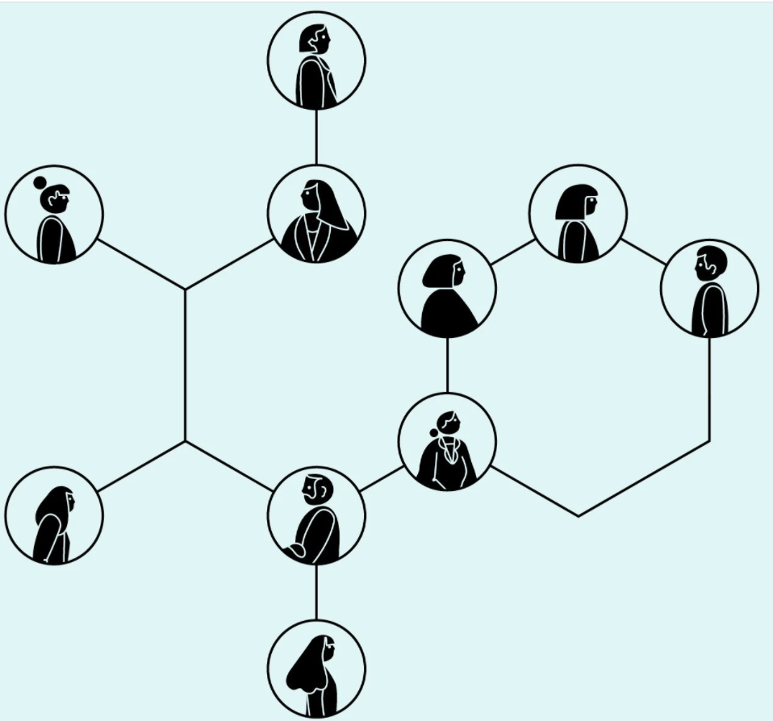

## What Google Learned From Its Quest to Build the Perfect Team

1. Psychological safety: Everyone feels safe in taking risks around their team members, and that they won’t be embarrassed or punished for doing so.

2. Dependability: Everyone completes quality work on time.
3. Structure and clarity: Everyone knows what their specific expectations are. These expectations must be challenging yet attainable.

4. Meaning: Everyone has a sense of purpose in their work (i.e., financial security, supporting family, helping the team succeed, etc.).
5. Impact: Everyone sees that the result of their work actually contributes to the organization’s overall goals.

