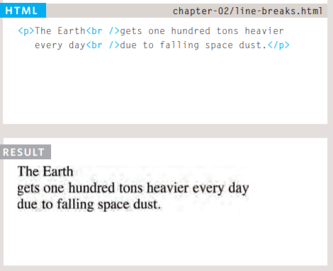
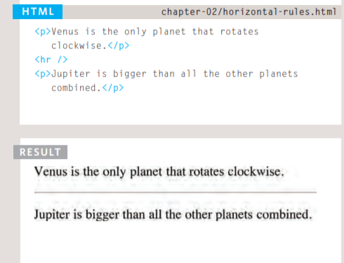

# TEXT

> When creating a web page, you add tags (known as markup) to the contents of the page.
>These tags provide extra meaning and allow browsers to show users the appropriate structure for the page.

## Headings
### <h1>
### <h2>
### <h3>
### <h4>
### <h5>
### <h6>
  
  Browsers display the contents of headings at different sizes. The contents of an <h1> element is the largest, and the contents of an <h6> element is the smallest. 
  As you can see in following picture:
  
  
  
  
 ## Paragraph
  ### 

  To create a paragraph, surround the words that make up the paragraph with an opening 
 tag and closing 
 tag.
  
  
 ## Bold & Italic
  ### <b>  The <b> element also represents a section of text that would be presented in a visually different way 
  (for example key words in a paragraph) although the use of the,<b> element does not imply any additional meaning.
  
  
  
  ### <i> 
  The <i> element also represents a section of text that would be said in a different way from surrounding content
  — such as technical terms, names of ships, foreign words, thoughts, or other terms that would usually be italicized.
  
  
  
  
  ## Superscript & Subscrip
   ### 
  The  element is used to contain characters that should be superscript such as the suffixes of
  dates or mathematical concepts like raising a number to a power like following picture .

  
  ###  
  The  element is used to contain characters that should be subscript. It is commonly
  used with foot notes or chemical formulas like following picture.
  
  
  
  
  
  ## White Space
  
  When the browser comes across two or more spaces next to each other, it only displays one space. 
  Similarly if it comes across a line break, it treats that as a single space too. This is known as **white space collapsing**. 
  
  
  
  ## Line Breaks & Horizontal Rules
  
  ###  
  As you have already seen, the browser will automatically show each new paragraph or heading on a new line. 
  But if you wanted to add a line break inside the middle of a paragraph you can use the line break tag  
  
  
  
  ### 

  To create a break between themes — such as a change of topic in a book or a new scene in a play 
  you can add a horizontal rule between sections using the 
 tag.
  
  
  
  ## Strong & Emphasis
  
  ### <strong> 
  The use of the <strong> element indicates that its content has strong importance. 
  For example, the words contained in this element might be said with strong emphasis.
  By default, browsers will show the contents of a <strong> element in bold.
  
  
  
  ### <em> 
  The <em> element indicates emphasis that subtly changes the meaning of a sentence.
  By default browsers will show the contents of an <em> element in italic.
  
  
  
  ## Quotations
  
  ### <blockquote>
  The <blockquote> element is used for longer quotes that take up an entire paragraph.
  Note how the 
 element is still used inside the <blockquote> element.
  
    
  ### <q> 
  The <q> element is used for shorter quotes that sit within a paragraph.Browsers are supposed to put 
  quotes around the <q> element, however Internet Explorer does not — therefore many people avoid using the <q> element.
  

  
## Abbreviations & Acronyms
  
 ### <abbr>
    If you use an abbreviation or an acronym, then the <abbr> element can be used. A title attribute on the opening tag is used to specify the full term.
  
  
 ## Citations & Definitions
  
  ### <cite>
  When you are referencing a piece of work such as a book, film or research paper, the <cite> element can be used to indicate where the citation is from.
  
  
  
  
  
  ### <dfn>
  The <dfn> element is used to indicate the defining instance of a new term.
  
  
  
  # Introducing CSS
  
  > CSS allows you to create rules that control the way that each individual box (and the contents of that box) is presented.
  
  
  On this page, you can see a basic HTML page., you can see the same HTML page, but I have added outlines to each of the elements 
  so that you can see how CSS will treat each element as if it lives inside its own box.
  
  
  
  In this example, block level elements are shown with red borders, and inline elements have green borders
    

CSS works by associating rules with HTML elements. These rules govern how the content of specified elements 
  should be displayed. A CSS rule contains two parts: a selector and a declaration.
  
  
  
CSS declarations sit inside curly brackets and each is made up of two parts: a property and a value, separated by 
  a colon. You can specify several properties in one declaration, each separated by a semi-colon. 
  
  
## CSS Selectors
  There are many different types of CSS selector that allow you to target rules to specific elements in an HTML document.
  This table introduces the most commonly used CSS selectors.
  
  
  
  # Basic JavaScript Instructions
  
  A script is a series of instructions that a computer can follow one-by-one. Each individual instruction or step is known as a statement.
  Statements should end with a semicolon.
  
  in the foolowing picture you can notice that:
  * Each of the lines of code in green is a statement.
  * The pink curly braces indicate the start and end of a code block. 
  * The code in purple determines which code should run.
  
    
## COMMENTS
  You should write comments to explain what your code does. They help make your code easier to read and understand.
  This can help you and others who read your code.
  
  

variables: It use to store data on it, inscript will have to temporarily store the bits of information it needs to do its job. 
  
  ### How to declare variables
  
  
  
  
  ### How to assign value into variables
  
  
  
  ## DATA TYPES
  
  JavaScript distinguishes between numbers, strings, and true or false values known as Booleans.
  
  * NUMERIC DATA TYPE 
  The numeric data type handles numbers. 0.75
  
 * STRING DATA TYPE
The strings data type consists of letters and other characters. **'Hi, IVY'** 
  
  * BOOLEAN DATA TYPE 
  Boolean data types can have one of two values: true or false.
  
  
  ### HOW TO STORE VARIABLE
  
 here you can see how to store number:
  
  
  
  how we can store variable:
  
  
  
  ## OPERATORS 
  Expressions rely on things called operators; they allow programmers to create a single value from one or more values.
  
  
  
  ## SWITCH STATEMENTS
  
  A switch statement starts with a variable called the switch value. Each case indicates a possible value for this variable
  and the code that should run if the variable matches that value.
  
  
  
  
  ### IF ... ELSE  **VS**    SWITCH
IF ... ELSE
• There is no need to provide an else option. (You can just use an if
statement.)
• With a series of if statements, they are all checked even if a match has been found

SWITCH
• You have a default option that is run if none of the cases match. 
  •If a match is found, that code is run; then the break statement stops the rest of
  the switch statement running.

> In this example, the purpose of the switch statement is to present the user with a different message depending
  on which level they are at. The message is stored in a variable called msg.
  
   
  

  #### After reading this paper please visit [Quiz02](Quiz02.PNG) and answer the Qustion.
  #### GOOD LUCK
  
