# Links

>Links are the defining feature of the web because they allow you to move from one web page to another — enabling the very idea of browsing or surfing

## Writing Links
Links are created using the <a> element. Users can click on anything between the opening <a> tag and the closing </a> tag. You specify which page you want to link to using the href attribute.

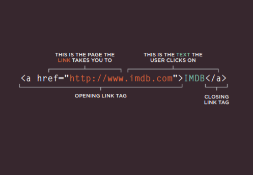


### Linking to Other Sites
### <a
Links are created using the a element which has an attribute called href. The value of the href attribute is the page that you want people to go to when they click on the link

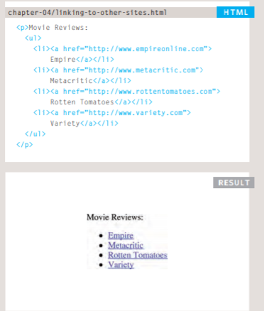

### Directory Structure

On larger websites it's a good idea to organize your code by placing the pages for each different section of the site into a new folder. Folders on a website are sometimes referred to as directories.

#### Structure
 The diagram on the right shows the directory structure for a fictional entertainment listings website called ExampleArts.

#### Relationships 
The relationship between files and folders on a website is described using the same terminology as a family tree

#### Homepages
 The main homepage of a site written in HTML (and the homepages of each section in a child folder) is called index.html.

 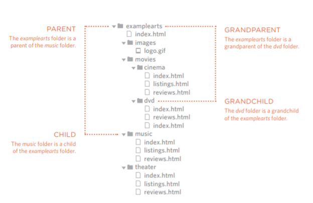

 #### Relative URLs
Relative URLs can be used when linking to pages within your own website. They provide a shorthand way of telling the browser where to find your files
```
When you are linking to a page on your own website, you do not need to specify the domain name. You can use relative URLs which are a shorthand way to tell the browser where a page is in relation to the current page.
```
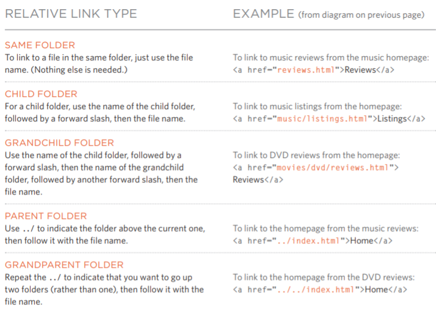

### Email Links
### mailto:
To create a link that starts up the user's email program and addresses an email to a specified email address, you use the <a> element. However, this time the value of the href attribute starts with mailto: and is followed by the email address you want the email to be sent to.

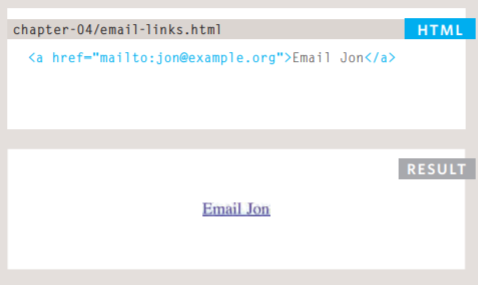

## Opening Links in a New Window
### target
If you want a link to open in a new window, you can use the target attribute on the opening <a> tag. The value of this attribute should be _blank.

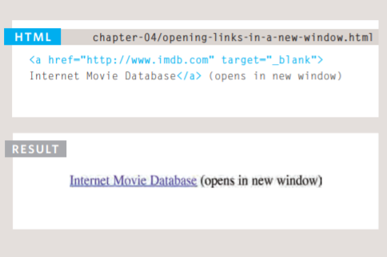

## Linking to a Specific Part of the Same Page
#### At the top of a long page you might want to add a list of contents that links to the corresponding sections lower down. Or you might want to add a link from part way down the page back to the top of it to save users from having to scroll back to the top.
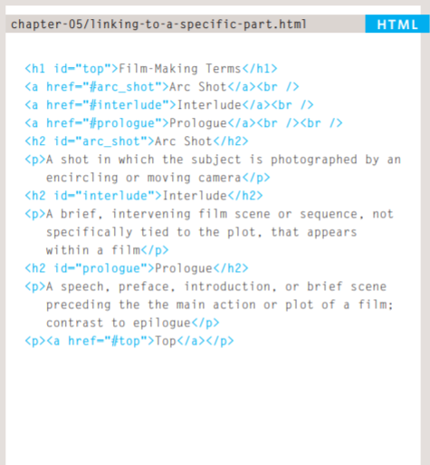

# Layout

#### Key Concepts in Positioning Elements
Building Blocks
 CSS treats each HTML element as if it is in its own box. This box will either be a block-level box or an inline box.
  Block-level boxes start on a new line and act as the main building blocks of any layout, while inline boxes flow between surrounding text. You can control how much space each box takes up by setting the width of the boxes (and sometimes the height, too). To separate boxes, you can use borders, margins, padding, and background colors.

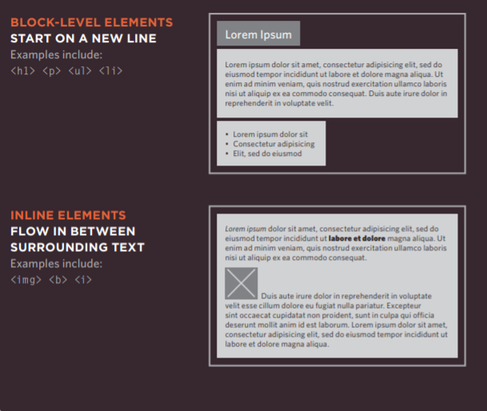

## Controlling the Position of Elements

### Normal flow
Every block-level element appears on a new line, causing each item to appear lower down the page than the previous one.


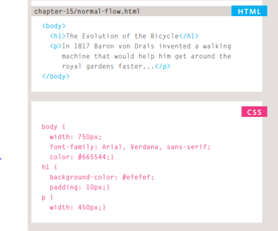

### Relative Positioning
 This moves an element from the position it would be in normal flow, shifting it to the top, right, bottom, or left of where it would have been placed.

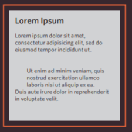

### Absolute positioning 
This positions the element in relation to its containing element. It is taken out of normal flow, meaning that it does not affect the position of any surrounding elements (as they simply ignore the space it would have taken up).
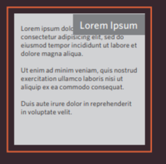

### Fixed Positioning 
This is a form of absolute positioning that positions the element in relation to the browser window, as opposed to the containing element.

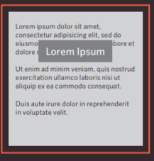

### Normal Flow
#### position:static

In normal flow, each block-level element sits on top of the next one. Since this is the default way in which browsers treat HTML elements, you do not need a CSS property to indicate that elements should appear in normal flow, but the syntax would be:
 
## Relative Positioning
### position:relative

Relative positioning moves an element in relation to where it would have been in normal flow.
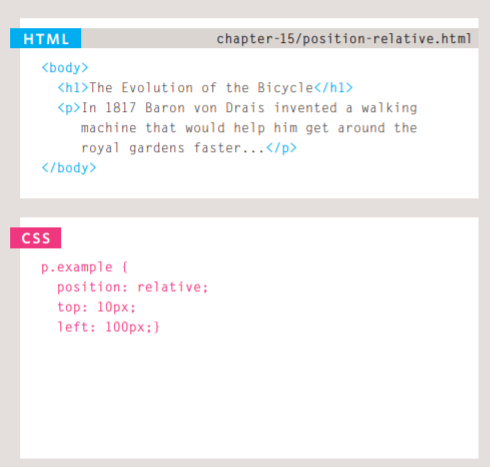


## position:absolute

When the position property is given a value of absolute, the box is taken out of normal flow and no longer affects the position of other elements on the page.

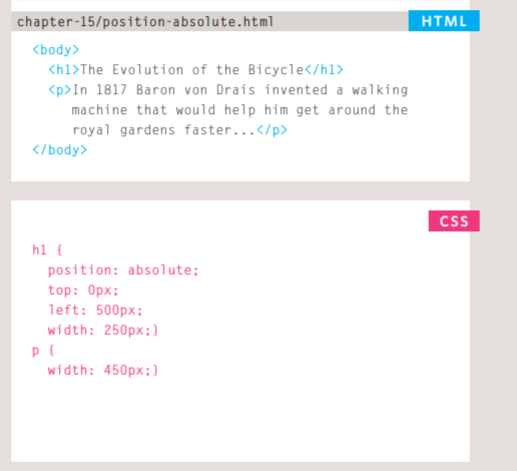

## position:fixed
Fixed positioning is a type of absolute positioning that requires the position property to have a value of fixed.

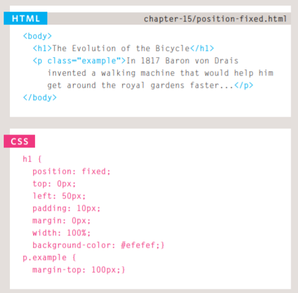

## z-index
 When you use relative, fixed, or absolute positioning, boxes can overlap. If boxes do overlap, the elements that appear later in the HTML code sit on top of those that are earlier in the page.
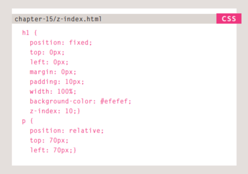

### Float

The float property allows you to take an element in normal flow and place it as far to the left or right of the containing element as possible.

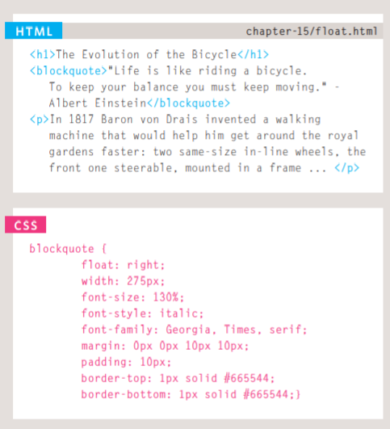

## Using Float to Place Elements Side-by-Side

A lot of layouts place boxes next to each other. The float property is commonly used to achieve this. When elements are floated, the height of the boxes can affect where the following elements sit.

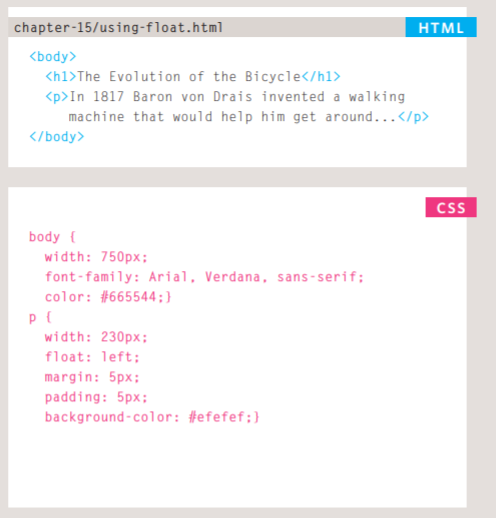
## Clearing Floats
### clear
The clear property allows you to say that no element (within the same containing element) should touch the left or righthand sides of a box. It can take the following values:
### left 
 The left-hand side of the box should not touch any other elements appearing in the same containing element. 
 ### right
 The right-hand side of the box will not touch elements appearing in the same containing element. 
 ### both
  Neither the left nor right-hand sides of the box will touch elements appearing in the same containing element. 
  ### none
   Elements can touch either side.
   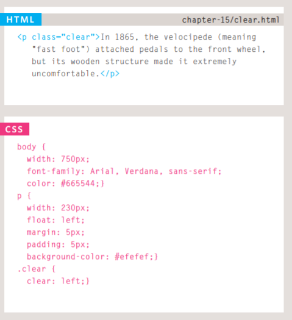

## Creating Multi-Column Layouts with Floats

Many web pages use multiple columns in their design. This is achieved by using a <div> element to represent each column. The following three CSS properties are used to position the columns next to each other:
### width
 This sets the width of the columns. 
 ### float 
 This positions the columns next to each other. 
 
 ### margin
  This creates a gap between the columns.

  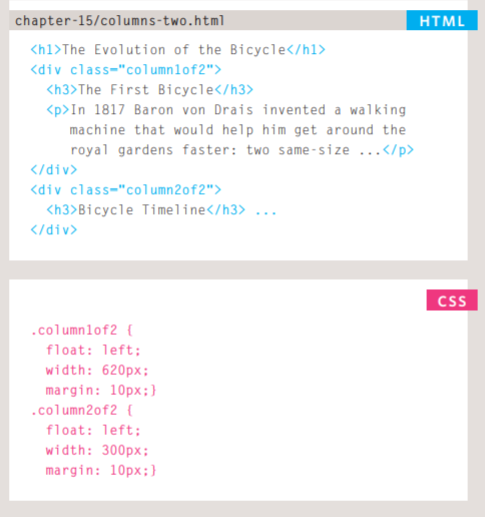

  ### Screen Sizes
  Different visitors to your site will have different sized screens that show different amounts of information, so your design needs to be able to work on a range of different sized screens.
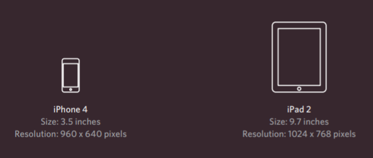

### Screen Resolution
Resolution refers to the number of dots a screen shows per inch. Some devices have a higher resolution than desktop computers and most operating systems allow users to adjust the resolution of their screens.
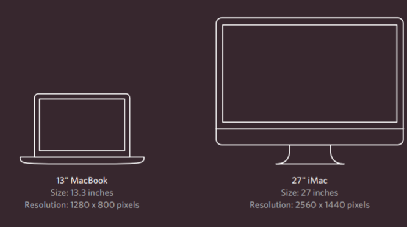

## Multiple Style Sheets
### @import

Some web page authors split up their CSS style rules into separate style sheets. For example, they might use one style sheet to control the layout and another to control fonts, colors and so on. Some authors take an even more modular approach to stylesheets, creating separate stylesheets to control typography, layout, forms, tables, even different styles for each sub-section of a site.

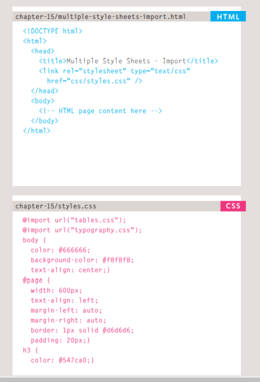

### link

On this page you can see the other technique for including multiple style sheets. Inside the <head> element is a separate <link> element for each style sheet.

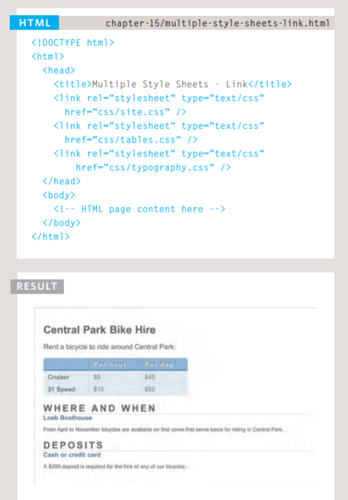

## Functions, Methods, and Objects
 
 ### WHAT IS A FUNCTION?

Functions let you group a series of statements together to perform a specific task. If different parts of a script repeat the same task, you can reuse the function (rather than repeating the same set of statements).

### A BASIC FUNCTION
In this example, the user is shown a message at the top of the page. The message is held in an HTML element whose id attribute has a value of message. The message is going to be changed using JavaScript.

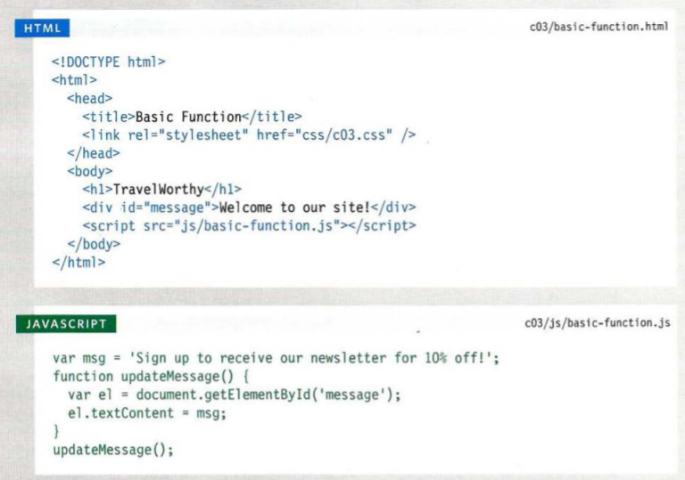

### Declaration a Function

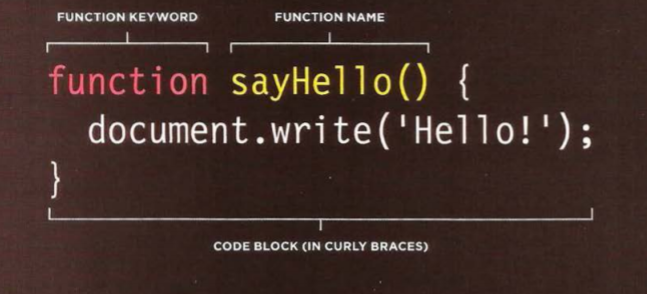

### Caliing a Function
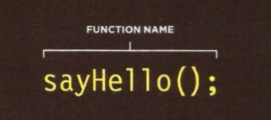

### Declaration Function that need information

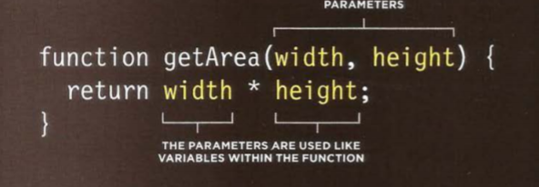

# How does pair programming work?

While there are many different styles, pair programming commonly involves two roles: 
* The Driver : The Driver is the programmer who is typing and the only one whose hands are on the keyboard. Handling the “mechanics” of coding,

*The Navigator: the Driver manages the text editor, switching files, version control, and—of course writing—code.

### Why pair program?
While learning to code, developers likely study several programming languages. Similar to a foreign language class, there are four fundamental skills that help anyone learn a new language: 
* Listening: hearing and interpreting the vocabulary 
* Speaking: using the correct words to communicate an idea 
* Reading: understanding what written language intends to convey
* Writing: producing from scratch a meaningful

### Reasons for Pair Programming

1. Greater efficiency:
It is a common misconception that pair programming takes a lot longer and is less efficient.

2. Engaged collaboration:When two programmers focus on the same code, the experience is more engaging and both programmers are more focused than if they were working alone.

3. Learning from fellow students:Everyone has a different approach to problem solving; working with a teammate can expose developers to techniques they otherwise would not have thought of.

4. Social skills:
Pair programming is great for improving social skills. When working with someone who has a different coding style, communication is key. This can become more difficult when two programmers have different personalities. 

5. Job interview readiness
A common step in many interview processes involves pair programming between a current employee and an applicant, either in person or through a shared screen. 

6. Work environment readiness
Many companies that utilize pair programing expect to train fresh hires from CS-degree programs on how they operate to actually deliver a product.