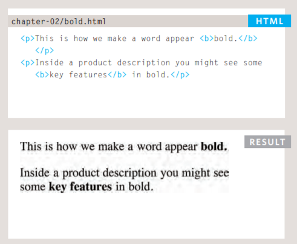
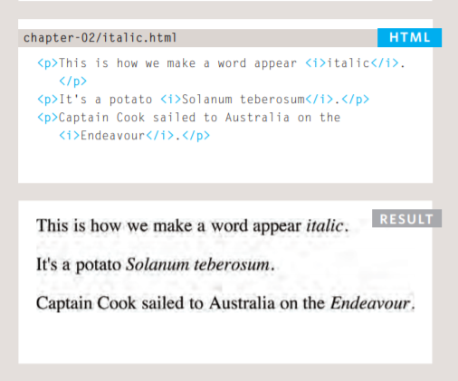

# Images

### Choosing Images for Your Site

Images can be used to set the tone for a site in less time than it takes to read a description.

If you are building a site from scratch, it is good practice to create a folder for all of the images the site uses.

## Adding Images

###  element. This is an empty element (which means there is no closing tag). It must carry the following two attributes:

## src
 This tells the browser where it can find the image file. This will usually be a relative URL pointing to an image on your own site. 

## alt
 This provides a text description of the image which describes the image if you cannot see it.

 

 ## Height & Width of Images

 You will also often see an  element use two other attributes that specify its size:
 ## height 
 This specifies the height of the image in pixels.
 ## width 
 This specifies the width of the image in pixels.

 ### Old Code: Aligning Images Horizontally

align chapter-05/aligning-images-horizontally.html HTML The align attribute was commonly used to indicate how the other parts of a page should flow around an image. It has been removed from HTML5 and new websites should use CSS to control the alignment of images

You must always specify a src attribute to indicate the source of an image and an alt attribute to describe the content of an image.

* You should save images at the size you will be using them on the web page and in the appropriate format.  

* Photographs are best saved as JPEGs; illustrations or logos that use flat colors are better saved as GIFs.

# Color

## Foreground Color

## rgb
 values These express colors in terms of how much red, green and blue are used to make it up. For example: rgb(100,100,90) 
 
 ## hex
  codes These are six-digit codes that represent the amount of red, green and blue in a color, preceded by a pound or hash # sign. For example: #ee3e80
  ## color names
   There are 147 predefined color names that are recognized by browsers. For example: DarkCyan

   

   ## background-color

   CSS treats each HTML element as if it appears in a box, and the background-color property sets the color of the background for that box.

   

## Understanding Color

## opacity, rgba

CSS3 introduces an entirely new and intuitive way to specify colors using hue, saturation, and lightness values.

## CSS3: HSL & H
The hsl color property has been introduced in CSS3 as an alternative way to specify colors. The value of the property starts with the letters hsl, followed by individual values inside parentheses for: 
### hue 
This is expressed as an angle (between 0 and 360 degrees). 

### saturation
 This is expressed as a percentage. 
### lightness
 This is expressed as a percentage with 0% being white, 50% being normal, and 100% being black.

 It is important to ensure that there is enough contrast between any text and the background color (otherwise people will not be able to read your content).

### Text
## Typeface Terminology

## font-family

The font-family property allows you to specify the typeface that should be used for any text inside the element(s) to which a CSS rule applies. The value of this property is the name of the typeface you want to use.

## font-size

The font-size property enables you to specify a size for the font. There are several ways to specify the size of a font. The most common are:
## pixels Pixels 
are commonly used because they allow web designers very precise control over how much space their text takes up. The number of pixels is followed by the letters px.
## percentages
 The default size of text in browsers is 16px. So a size of 75% would be the equivalent of 12px, and 200% would be 32px.

## Type Scales

You may have noticed that programs such as Word, Photoshop and InDesign offer the same sizes of text.

## Font Format

## Bold (font-weight)

## Italic
### font-style

### Leading
#### line-height
Leading (pronounced ledding) is a term typographers use for the vertical space between lines of text. In a typeface, the part of a letter that drops beneath the baseline is called a descender, while the highest point of a letter is called the ascender. Leading is measured from the bottom of the descender on one line to the top of the ascender on the next

## text-align

### left 
This indicates that the text should be left-aligned.
### right 
This indicates that the text should be right-aligned. 
### center 
This allows you to center text. 
### justify
 This indicates that every line in a paragraph, except the last line, should be set to take up the full width of the containing box.

## vertical-align
The vertical-align property is a common source of confusion. It is not intended to allow you to vertically align text in the middle of block level elements such as 
 and 
, although it does have this effect when used with table cells (the <td> and <th> elements).

### text-shadow

The text-shadow property has become commonly used despite lacking support in all browsers. It is used to create a drop shadow, which is a dark version of the word just behind it and slightly offset. It can also be used to create an embossed effect by adding a shadow that is slightly lighter than the text.

### Attribute Selectors

## JPEG vs PNG vs GIF
## TL;DR
### Use JPEG format for all images that contain a natural scene or photograph where variation in colour and intensity is smooth. 

### Use PNG format for any image that needs transparency or for images with text & objects with sharp contrast edges like logos. Use GIF format for images that contain animations.

## Compression

#### Compression can be of two types — lossless and lossy. 
 In lossless compression, it is possible to reconstruct the original image from the compressed image because there is no information loss during compression.

Lossy compression algorithms always have a superior compression ratio (the ratio of size of compressed image to original image) as compared to lossless compression.

* JPEG is a lossy compression specification that takes advantage of human perception,JPEG images are best suited for photographs and paintings of natural scenes where the variations in colour and intensity are smooth. 

* PNG is a lossless image format using DEFLATE compression. No data is lost during compression and no compression artefacts are introduced in the image. For this reason, a PNG image would retain higher quality than an image than JPEG and would look a lot sharper.

* GIF is also a lossless image format that uses LZW compression algorithm. It was favoured over PNG for simple graphics in websites in its early days because the support of PNG was still growing. 

### Transparency

## JPEG 
images don’t support transparency and are hence not usable for such cases.

## PNG 
images support transparency in two ways — inserting an alpha channel that allows partial transparency or by declaring a single colour as transparent (index transparency). 

## GIF 
images support transparency by declaring a single colour in the colour palette as transparent (index transparency). 

## Colours
There is a significant difference in the number of colours that can be supported by these 3 formats.

### JPEG 
images can support around 16 million colours. This is what makes them suitable for storing images of natural scenes.

### PNG 
images mainly have two modes — PNG8 and PNG24. PNG8 can support upto 256 colours whereas PNG24 can handle upto 16 million colours like a JPEG image. 

### GIF 
images are limited to 256 colours. If index transparency is used, then one of these 256 colours is assigned as transparent and the remaining 255 are used for other colours.

### Animation

Animation, in this case, refers to any change or movement in the image. It doesn’t necessarily have to have frame rates like an animated video, but essentially a part or the entire image changes with time.

### ImageKit.io
 is a cloud-based image optimisation and transformation product that can automatically deliver images in the most suitable format. This ensures that you are able to deliver an efficient graphical experience on your website and app every time, effortlessly.

After reading this paper please visit [Quiz05](Quiz05.md) and answer the Qustion

