### Understanding The Problem Domain Is The Hardest Part Of Programming

There are many common answers to this question:

* Learning a new technology
* Naming things
* Testing your code
* Debugging
* Fixing bugs
* Making software maintainable

## A familiar problem
In a good portion of my Pluralsight courses I show the viewer how to build the “Protein Tracker” application.

When I first started using the Protein Tracker example in ** my Android course **, I was just looking for a simple example of an application that could be easily understood and implemented.

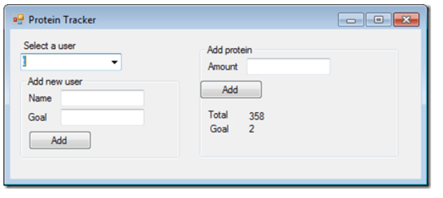

** What I found with this simple application was that because it was so easy to understand, the focus was taken off of the problem domain and put instead on the technology. **

** By creating a familiar problem domain, I found that both the tasks of me teaching a new technology and the viewer learning that technology were much easier, because it is very difficult to learn more than one thing at once. **

## Why problem domains are hard

** The real world is a messy place.  Many of the problem domains we face as programmers are difficult to understand and look completely different depending on your viewpoint. **

As programmers, we also are often not given complete information about the problem domain, so we don’t even have the information we need to understand it.

## Programming is easy if you understand the problem domain

The more and more I write code, the more I learn that understanding the problem is the most critical piece to the equation. It is very difficult to solve a problem before you know the question.  It’s like buzzing in on Jeopardy before you hear the clue and shouting out random questions.

## What can you do about it?

If understanding the problem domain is the hardest part of programming and you want to make programming easier, you can do one of two things:

1. Make the problem domain easier 
2. Get better at understanding the problem domain

You can often make the problem domain easier by cutting out cases and narrowing your focus to a particular part of the problem.

** It is easy to fall into the trap of thinking you understand enough of the problem to get started coding it **

## Quick update on my new product

So many developers don’t realize ** how much of an impact marketing themselves and branding can have on their opportunities. **

## WHAT IS AN OBJECT? 

Objects group together a set of variables and functions to create a model of a something you would recognize from the real world. In an object, variables and functions take on new names

# create an object:literal notation

is basically an array of key:value pairs, with a colon separating the keys and values, and a comma after every key:value pair, except for the last, just like a regular array. Values created with anonymous functions are methods of your object. Simple values are properties

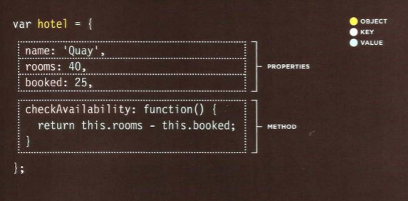

## Document Object Model

### THE DOM TREE IS A MODEL OF A WEB PAGE

As a browser loads a web page, it creates a model of that page. The model is called a DOM tree, and it is stored in the browsers' memory. It consists of four main types of nodes.

Each node is an object with methods and properties. Scripts access and update this DOM tree (not the source HTML file). Any changes made to the DOM tree are reflected in the browser

 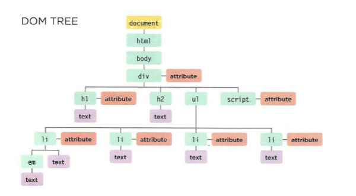

## WORKING WITH THE DOM TREE

Accessing and updating the DOM tree involves two steps: 
1. Locate the node that represents the element you want to work with. 
2. Use its text content, child elements, and attributes

STEP 1: ACCESS THE ELEMENTS 

## SELECT AN INDIVIDUAL ELEMENT NODE
 

Here are three common ways to select an individual element:
### get El ement Byld()
 Uses the value of an element's id attribute .
  
### query Se1ector ()
 Uses a CSS selector, and returns the first matching element

## SELECT MULTIPLE ELEMENTS (NODELISTS)

There are three common ways to
select multiple elements.

## getElementsByClassName()
Selects all elements that have
a specific value for their class
attribute.

## getElementsByTagName()
Selects all elements that have the specified tag name 

## querySelectorAll()
Uses a CSS selector to select all matching elements.

## TRAVERSING BETWEEN ELEMENT NODES
 

You can move from one element
node to a related element node.
## parentNode
Selects the parent of the current element node 

## previousSibl ing / nextSibl ing
Selects the previous or next
sibling from the DOM tree.

## firstChild / lastChild
Select the first or last child of the current element. 

# STEP 2: WORK W ITH THOSE ELEMENTS 

## ACCESS/ UPDATE TEXT NODES
 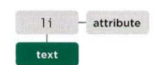

The text inside any element is stored inside a text node. To access the text node above: 
1. Select the <li >element 
2. Use the firstChild property to get the text node 
3. Use the text node's only property (nodeValue) to get the text from the element

### nodeValue
This property lets you access or update contents of a text node. 

## WORK WITH HTML CONTENT
 
One property allows access to child elements and text content:
 * innerHTML 
  just the text content: 
  * textContent See p216 Several methods let you create new nodes, add nodes to a tree, and remove nodes from a tree:
   * create Element()
   * createTextNode() 
   * appendChi ld ()/ removeChild() This is called DOM manipulation.

## ACCESS OR UPDATE ATTRIBUTE VALUES
 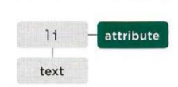

Here are some of the properties and methods you can use to work with attributes:
 className /id 
 Lets you get or update the value of the class and id attributes. 
* hasAttribute()
*  getAttribute() 
* setAttri bute() 
* removeAttribute()

## SELECTING ELEMENTS USING ID ATTRIBUTES 

get ElementByid () allows you to select a single element node by specifying the value of its id attribute.
 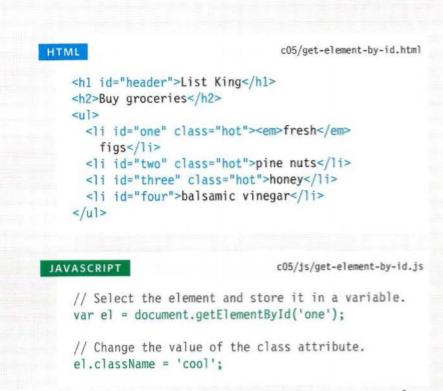

## SELECTI NG ELEMENTS USING CLASS ATTRIBUTES

The get El ementsByClass Name() method allows you to select elements whose c1ass attribute contains a specific value.The method has one parameter:
the class name which is given
in quotes within the parentheses
after the method name. 

 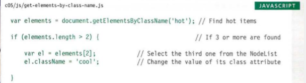

## LOOPING THROUGH A NODELIST

If you want to apply the same code to numerous elements, looping through a Nodelist is a powerful technique.It involves finding out how many items are in the Nodelist, and then setting a counter to loop through them, one-by-one.
 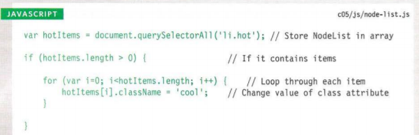

# TRAVERSING THE DOM
When you have an element node, you can select another element in relation to it using these five properties. This is known as traversing the DOM.

### parentNode 

This property finds the element node for the containing (or parent) element in the HTML. (1) If you started with the first <l i >element, then its parent node would be the one representing the <ul >element.

### previousSiblingnextSibling

These properties find the previous or next sibling of a node if there are siblings. If you started with the first <1 i > element, it would not have a previous sibling. However, its next sibling (2) would be the node representing the second <l i >.

### first Child /last Child

These properties find the first or last child of the current element. If you started with the <u1 > element, the first child would be the node representing the first <li> element, and (3) the last child would be the last <1i >

 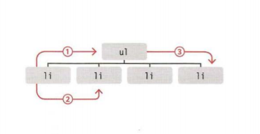

### PREVIOUS & NEXT SIBLING 

You have just seen that these properties can return inconsistent results in different browsers. However, it is safe to use them when there is no whitespace between elements.For this example, all spaces between the HTML elements have been removed. In order to demonstrate these properties, the second list item is selected using getEl ementByld ().

 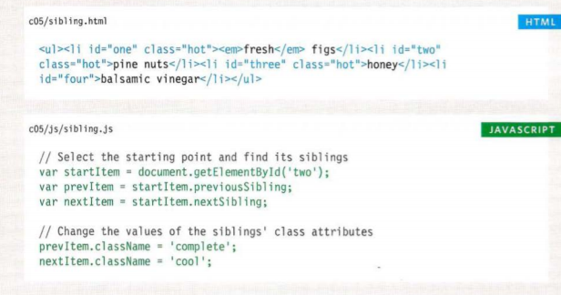

## ACCESS & UPDATE TEXT & MARKUP WITH INNERHTML

Using the i nnerHTML property, you can access and amend the contents of an element, including any child elements.

innerHTML 
When getting HTML from an element, the i nnerHTML property will get the content of an element and return it as one long string, including any markup that the element contains. When used to set new content for an element, it will take a string that can contain markup and process that string, adding any elements within it to the DOM tree.
 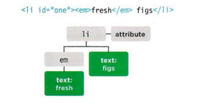

## UPDATE TEXT & MARKUP 

This example starts by storing the first list item in a variable called firstltem.
It then retrieves the content of
this list item and stores it in a
variable called i temContent.Finally, the content of the list
item is placed inside a link. Note how the quotes are escaped.  

 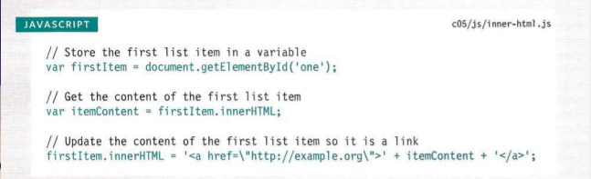

## ADDING ELEMENTS USING DOM MANIPULATION

DOM manipulation offers another technique to add new content to a page (rather than i nnerHTML). It involves three steps:

## CREATE THE ELEMENT createElement () 
You start by creating a new element node using the createElement() method. This element node is stored in a variable. When the element node is created, it is not yet part of the DOM tree. It is not added to the DOM tree until step 3.

## createTextNode()

createTextNode() creates anew text node. Again, the node is stored in a variable. It can be added to the element node using the appendChi l d () method

## ADD IT TO THE DOM
appendChild() Now that you have your element (optionally with some content in a text node), you can add it to the DOM tree using the appendChi 1 d () method. 

# REMOVING AN ELEMENT FROM THE DOM TREE

This example uses the removeChi1d () method to remove the fourth item from the list. JAVASCRIPT The first variable, removeEl, stores the actual element you want to remove from the page.
The second variable, cont a i nerEl, stores the <u1> element that contains the element you want to remove.

 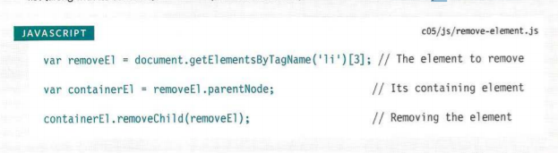

## CHECK FOR AN ATTRIBUTE AND GET ITS VALUES

The hasAttri bute() method of any element node lets you check if an attribute exists. The attribute name is given as an argument in the parentheses.Using hasAttribute() in an if statement like this means that the code inside the curly braces will run only if the attribute exists on the given element

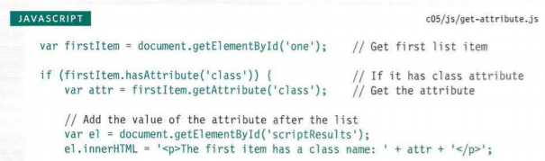

## REMOVING ATTRI BUTES
To remove an attribute from an element, first select the element, then call removeAttribute () . It has one parameter: the name of the attribute to remove.Trying to remove an attribute that does not exist will not cause an error, but it is good practice to check for its existence before attempting to remove it.

 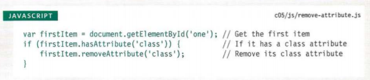

After reading this paper please visit [Quiz06](Quiz06.md) and answer the Qustion
