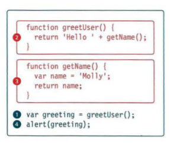
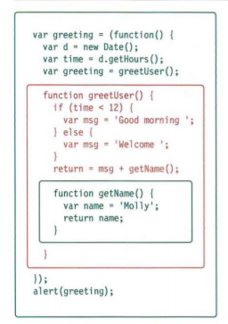
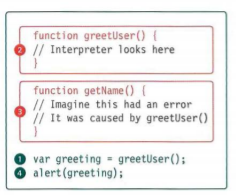
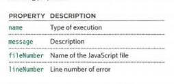
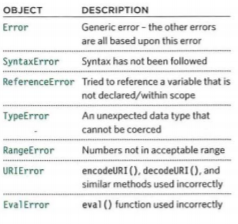
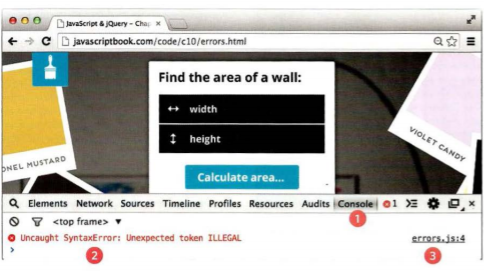
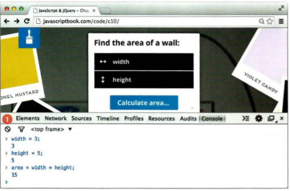
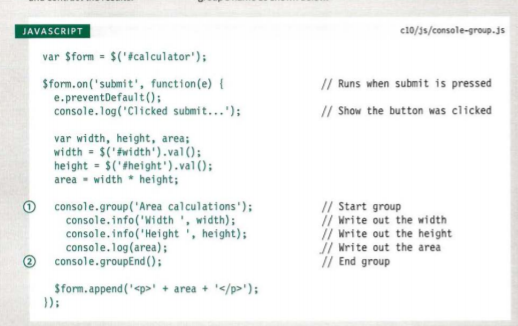
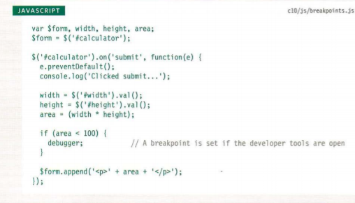

# Error Handling & Debugging


### ORDER OF EXECUTION

##### To find the source of an error, it helps to know how scripts are processed.The order in which statements are executed can be complex; some tasks cannot complete until another statement or function has been run: 



This script above creates a greeting message, then writes it to an alert box (see right-hand page). In order to create that greeting, two functions are used: greetUser () and getName () .

To complete step one, the interpreter needs the results of the functions in steps two and three (because the message contains values returned by those functions). The order of execution is more like this: 1, 2, 3, 2, 1, 4.

1. The greeting variable gets its value from the greetUser() function.

2. greetUser() creates the message by combining the string 'Hello ' with the result of getName ().

3. getName () returns the name to greetUser().

2. greetUser() now knows the name, and combines it with the string. It then returns the message to the statement that called it in step 1.

1. The value of the greeting is stored in memory.

4. This greeting variable is written to an alert box


## EXECUTION CONTEXTS 

The JavaScript interpreter uses the concept of execution contexts. There is one global execution context; plus, each function creates a new new execution context. They correspond to variable scope.

Every statement in a script lives in one of three execution contexts:

* GLOBAL CONTEXT:
Code that is in the script, but not in a function. There is only one global context in any page.

* FUNCTION CONTEXT
Code that is being run within a function. Each function has its own function context.

* EVAL CONTEXT
Text is executed like code in an internal function called eval.

## VARIABLE SCOPE
The first two execution contexts correspond with the notion of scope:
* GLOBAL SCOPE
If a variable is declared outside a function, it can be used anywhere because it has global scope.If you do not use the var keyword when creating
a variable, it is placed in global scope.
* FUNCTION-LEVEL SCOPE
When a variable is declared within a function,it can only be used within that function. 


## EXECUTION CONTEXT & HOISTING 

Each time a script enters a new execution context, there are two phases of activity:
1. PREPARE
• The new scope is created
• Variables, functions, and arguments are created
• The value of the this keyword is determined

2. EXECUTE
• Now it can assign values to variables
• Reference functions a

Understanding that these two phases happen helps with understanding a concept called hoisting. You
may have seen that you can:
• Call functions before they have been declared.

• Assign a value to a variable that has not yet been
declared

## UNDERSTANDING SCOPE

In the interpreter, each execution context has its own va ri ables object.It holds the variables, functions, and parameters available within it.Each execution context can also access its parent's v a ri ables object. 



## UNDERSTANDING ERRORS

If a JavaScript statement generates an error, then it throws an exception. At that point, the interpreter stops and looks for exception-handl ing code.




## ERROR OBJECTS

Error objects can help you find where your mistakes are and browsers have tools to help you read them.

When an Error object is created, it will contain the following properties: 



There are seven types of built-in error objects in JavaScript. You'll see them on the next two pages:




1. In the red on the left, you can see this is aSyntaxError. An unexpected character was found

2. On the right, you can see that the error happened in a file called errors .js on line 4.


## ERROR OBJECTS CONTINUED

Syntax Error SYNTAX IS NOT CORRECT This is caused by incorrect use of the rules of the language. It is often the result of a simple typo.

* MISMATCHING OR UNCLOSED QUOTES document .write ("Howdyl ); 

SyntaxError: Unexpected EOF 

* MISSING CLOSING BRACKET document .

getElementByid('page' I SyntaxErr or : Expected token ' ) '

* MISSING COMMA IN ARRAY

Would be same for missing] at the end
var l ist = ['Item 1', 'Item 2 'l'rtem 3'];
SyntaxError: Expected token ']'

## Ref erenceError

* VARIABLE DOES NOT EXIST
This is caused by a variable that is not declared or is out of scope.

* VARIABLE IS UNDECLARED
var width = 12 ;
var area = width * llt!ftNU! ;

ReferenceError: Can ' t find variable:
height 

* NAMED FUNCTION IS UNDEFINED

document.write ( randomFunction() ) ;

ReferenceError: Can't find variable :
randomFunction


## Type Error

* VALUE IS UNEXPECTED DATA TYPE

This is often caused by trying to use an object or method that does not exist.

* INCORRECT CASE FOR document OBJECT
document.write ('Oops! ');
TypeError: 'undefined' is not a function
(evaluating 'Document.write('Oops!')')

* INCORRECT CASE FOR write() METHOD

* document. eJrite('Oops!') ;

TypeError: 'undefined' is not a function (evaluating 'document.Write( 'Oops!')')

# NaN 
NOT AN ERROR
 Note: If you perform a mathematical operation using a value that is not a number, you end up with the value of NaN, not a type error.


 * Error
  GENERIC ERROR OBJECT 
  The generic Error object is the template (or prototype) from which all other error objects are created.

  # HOW TO DEAL WITH ERRORS

  Now that you know what an error is and how the browser treats them,
there are two things you can do with the errors. 

1. DEBUG THE SCRIPT TO FIX ERRORS: 
If you come across an error while writing a script (or when someone reports a bug), you will need to debug the code, track down the source of the error, and fix it.

2. 2: HANDLE ERRORS GRACEFULLY
You can handle errors gracefully using try, catch,throw, and f i na 1 ly statements. 

## A DEBUGGING WORKFLOW

Debugging is about deduction: eliminating potential causes of an error. 

# BROWSER DEV TOOLS & JAVASCRIPT CONSOLE


The JavaScript console will tell you when there is a problem with a script,
where to look for the problem, and what kind of issue it seems to be

CHROM E/ OPERA On a PC
*  press the F12 key or:
 1. Go to the options menu (or three line menu icon) 
 2. Select Toots or More tools.
  3. Select JavaScript Console or Developer Tools On a Mac press Alt + Cmd + J. 
   4. Go to the View menu. 
   5. Select Developer.
    6. Open the JavaScript Console or Developer Tools option and select Console

    # HOW TO LOOK AT ERRORS IN CHROME

    The console will show you when there is an error in your JavaScript. It also displays the line where it became a problem for the interpreter


1. The Console option is selected.

2. The type of error and the error
message are shown in red.

3. The file name and the line
number are shown on the right-hand side of the console. 


## TYPING IN THE CONSOLE IN CHROME

You can also just type code into the console and it will show you a result.



## GROUPING MESSAGES

1. If you want to write a set of
related data to the console, you can use the console. group ()

2. When you have finished writing out the results for the group, to indicate the end of the group the console .groupEnd ()



## BREAKPOINTS
You can pause the execution of a script on any line using breakpoints. Then you can check the values stored in variables at that point in time. 

# DEBUGGER KEYWORD




## HANDLING EXCEPTIONS
If you know your code might fail, use try, catch, and finally.
Each one is given its own code block.
```
try {
II Try to execute this code
catch (exception) {
II If there is an exception, run this code
finally {
//II This always gets executed
}

* TRY
First, you specify the code that you think might throw an exception within the try block.

* CATCH
If the try code block throws an
exception, catch steps in with an
alternative set of code. 

* FI NALLY
The contents of the fina11y code block will run either way - whether the try block succeeded or failed. 

