# list 

There are lots of occasions when we need to use lists. HTML provides us with three different types:

* Ordered lists are lists where each item in the list is numbered.
* Unordered lists are lists that begin with a bullet point.
* Definition lists are made up of a set of terms along with the definitions for each of those terms

### Ordered Lists
```
  <ol> 

The ordered list is created with the <ol> element. 

<li>

 Each item in the list is placed between an opening <li> tag and a closing </li> tag
```
next picture to show how write order list in html

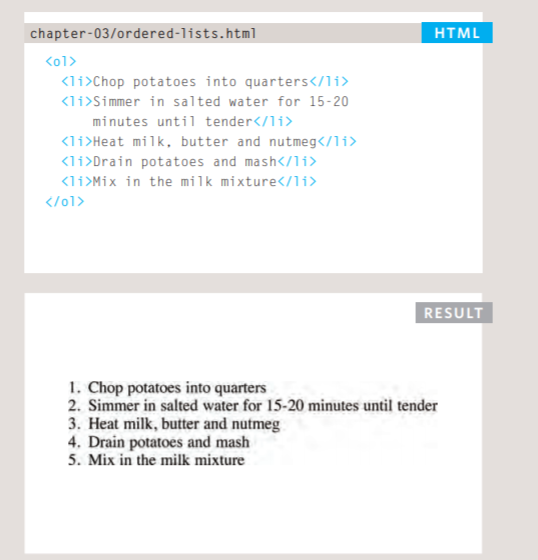

### Unordered Lists

```
<ul>

The unordered list is created
with the <ul> element.

<li>

Each item in the list is placed
between an opening <li> tag
and a closing </li> tag.
```

next picture to show how write unorder list in html

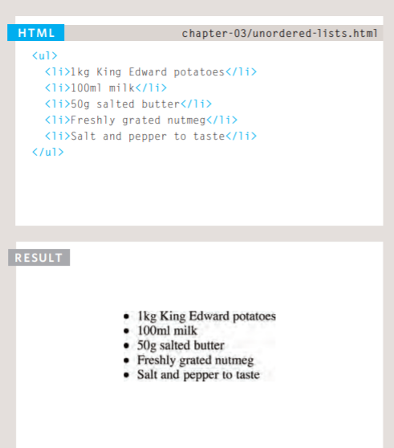

### Definition Lists

```
<dl> 
The definition list is created with the <dl> element and usually consists of a series of terms and their definitions. 

 <dt> 
 This is used to contain the term being defined.
 
  <dd>
   This is used to contain the definition.
```

next picture to show how write definition list in html
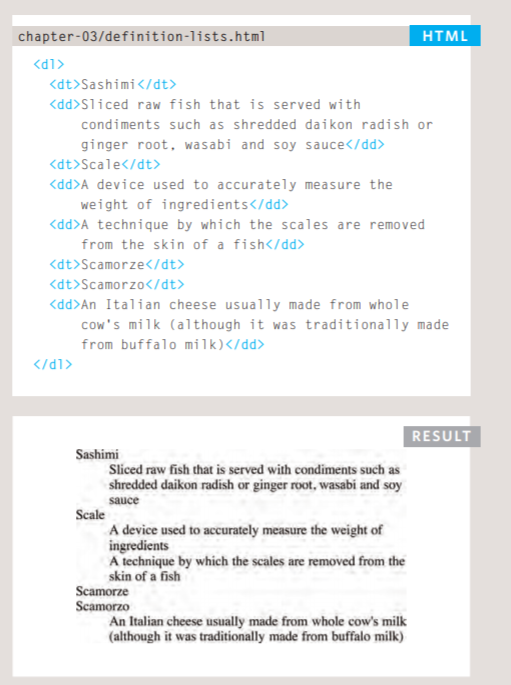

### Nested lists
```
You can put a second list inside an <li> element to create a sublist or nested list
```

next picture to show how write nested list in html

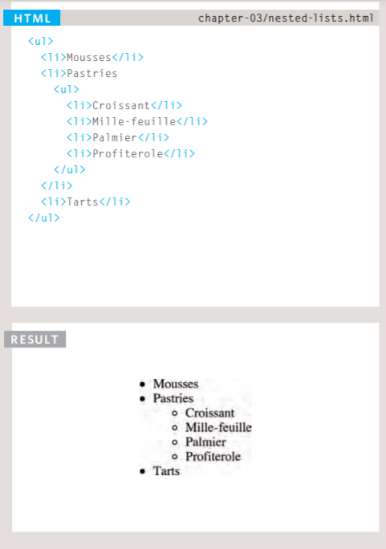


## Boxes

### Box Dimnsions
#### width, height

By default a box is sized just big enough to hold its contents. To set your own dimensions for a box you can use the height and width properties.

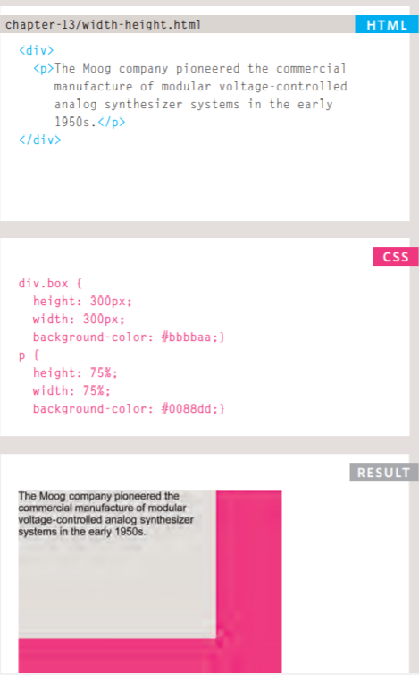

### Limiting Width
#### min-width, max-width

Some page designs expand and shrink to fit the size of the user's screen. In such designs, the min-width property specifies the smallest size a box can be displayed at when the browser window is narrow, and the max-width property indicates the maximum width a box can stretch to when the browser window is wide.

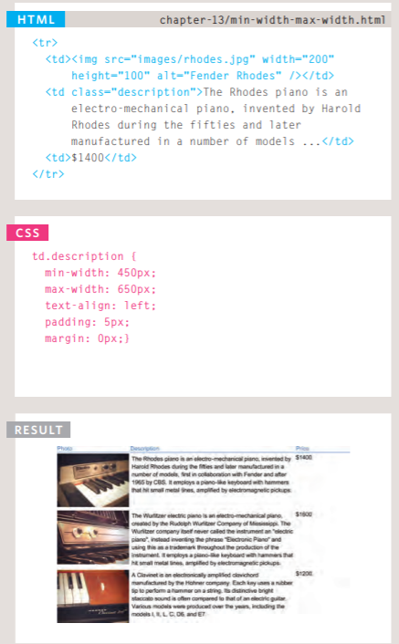


### Limiting Height
#### min-height, max-height

In the same way that you might want to limit the width of a box on a page, you may also want to limit the height of it. This is achieved using the min-height and max-height properties.

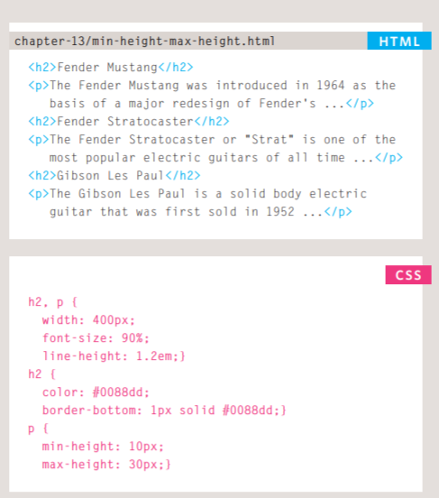

## Overflowing Content
### overflow

The overflow property tells the browser what to do if the content contained within a box is larger than the box itself. It can have one of two values:

*  hidden 
This property simply hides any extra content that does not fit in the box. 

* scroll 
This property adds a scrollbar to the box so that users can scroll to see the missing content

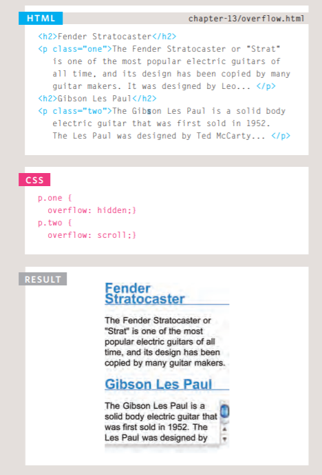

### Border, Margin & Padding

Every box has three available properties that can be adjusted to control its appearance:

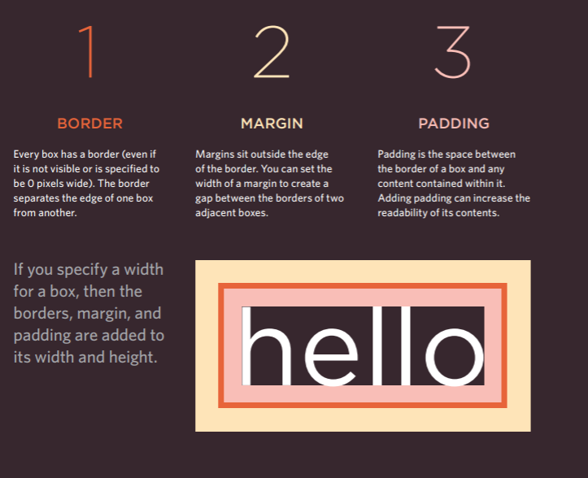

### White space & Vertical Margin

The padding and margin properties are very helpful in adding space between various items on the page.
 
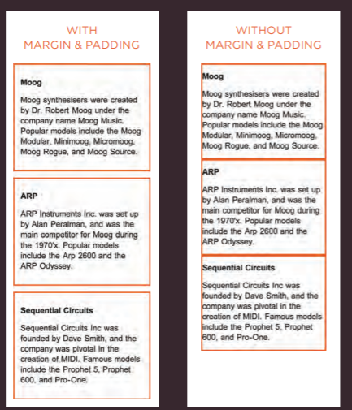

## Border Width

You can control the individual size of borders using four separate properties: 
* border-top-width 
* border-right-width 
* border-bottom-width 
* border-left-width

The border-width property is used to control the width of a border. The value of this property can either be given in pixels or using one of the following values:
 thin 
 medium 
 thick

 
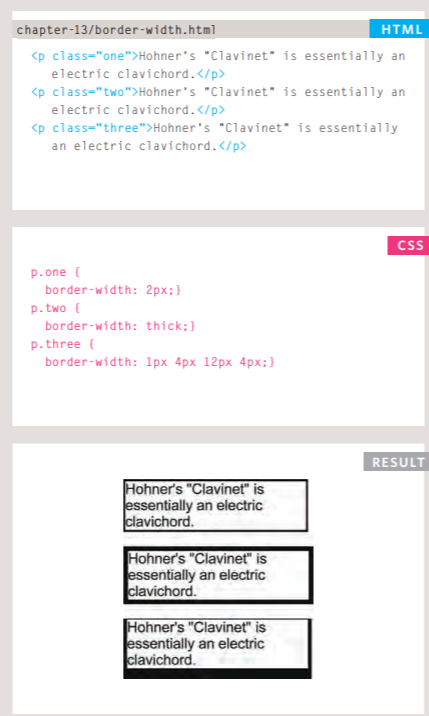

## Border Style

You can control the style of a border using the border-style property. This property can take the following values: 
* solid a single solid line
* dotted a series of square dots
* dashed a series of short lines 
* double two solid lines (the value of the border-width property creates the sum of the two lines)
* groove appears to be carved into the page
* ridge appears to stick out from the page
* inset appears embedded into the page
* outset looks like it is coming out of the screen
* hidden / none no border is shown

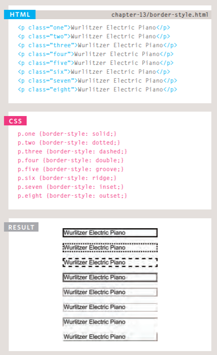


## Border Color

You can specify the color of a border using either RGB values, hex codes or CSS color names. It is possible to individually control the colors of the borders on different sides of a box using:
*  border-top-color
* border-right-color
* border-bottom-color
* border-left-color


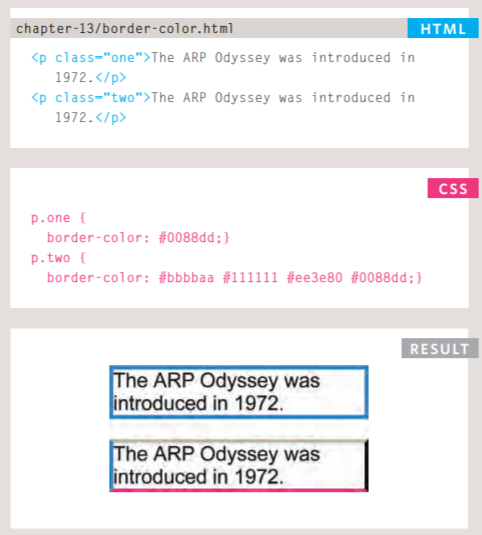


## Shorthand
### border
The border property allows you to specify the width, style and color of a border in one property.

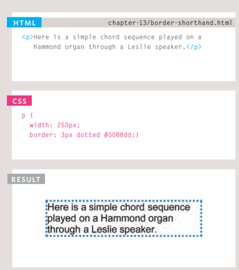


## Padding

The padding property allows you to specify how much space should appear between the content of an element and its border. The value of this property is most often specified in pixels (although it is also possible to use percentages or ems). If a percentage is used, the padding is a percentage of the browser window.
You can specify different values for each side of a box using:
* padding-top
* padding-right
* padding-bottom
* padding-left

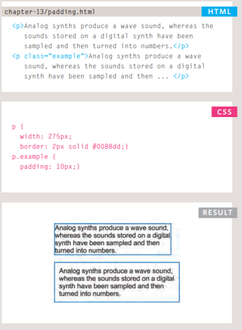


## margin

The margin property controls the gap between boxes. Its value is commonly given in pixels, although you may also use percentages or ems.

You can specify values for each side of a box using:
* margin-top
* margin-right
* margin-bottom
* margin-left


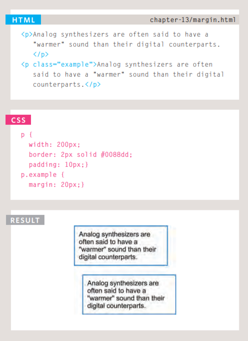

## IE6 Box Model

When you specify the width of a box, any padding or margin should be added to the width of it. Internet Explorer 6, however, has a quirk whereby it includes the padding and margins in the width of the box.

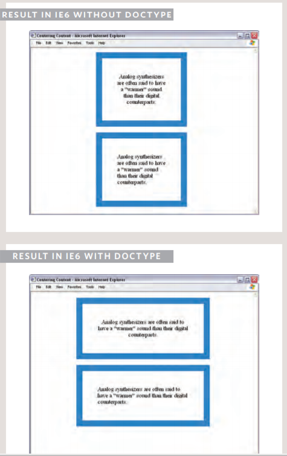

## Change Inline/Block
### display

* inline 
This causes a block-level element to act like an inline element.
* block This causes an inline element to act like a block-level element.
* inline-block This causes a block-level element to flow like an inline element, while retaining other features of a block-level element.
* none This hides an element from the page. In this case, the element acts as though it is not on the page at all.

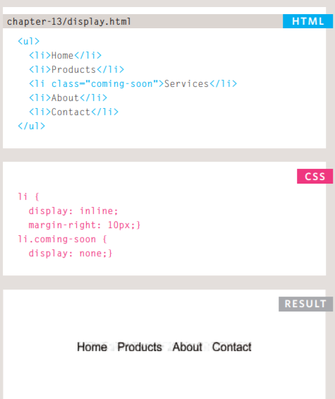

## Hidden Box
The visibility property allows you to hide boxes from users but It leaves a space where the element would have been

This property can take two values:
*  hidden This hides the element.
* visible This shows the element.

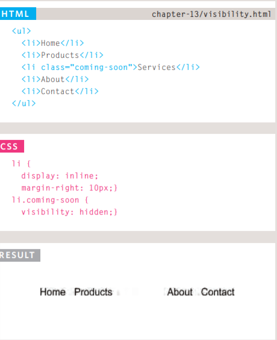

CSS3 has introduced the ability to create image borders and rounded borders.


## USING QUOTES INSIDE A STRING

Because strings can live in single or double quotes, if you just want to use double quotes in the string, you could surround the entire string in single quotes.
 If you just want to use single quotes in the string, you could surround the string in double quotes (as shown in the third line of this code example). 
 You can also use a technique called **escaping** the quotation characters. This is done by using a **backwards slash** (or "backslash") before any type of quote mark that appears within a string.

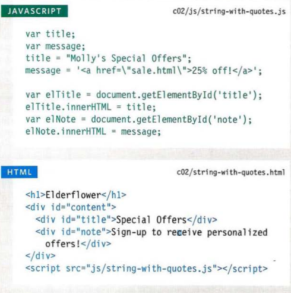

## USING A VARIABLE TO STORE A BOOLEAN
 
First, Booleans are used when the value can only be true/ fa 1 se. You could also think of these values as on/off or 0/1: true is equivalent to on or 1, fa 1 se is equivalent to off or 0.

Second, Booleans are used when your code can take more than one path. Remember, different code may run in different circumstances.

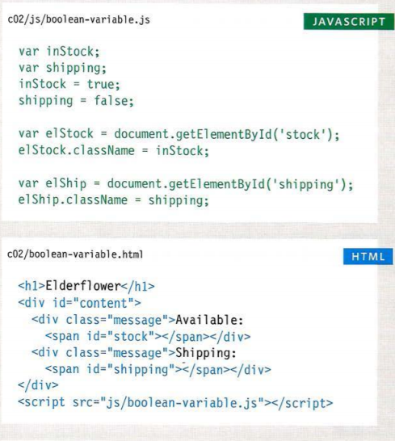

## SHORTHAND FOR CREATING VARIABLES

Programmers sometimes use shorthand to create variables. Here are three variations of how to declare variables and assign them values:
1. Variables are declared and values assigned in the same statement.
2. Three variables are declared on the same line, then values assigned to each.
 3. Two variables are declared and assigned values on the same line. 

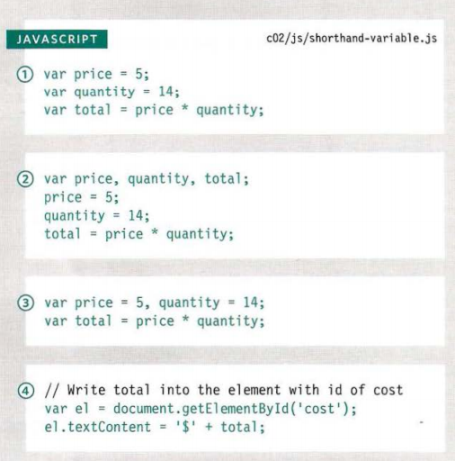

## CHANGING THE VALUE OF A VARIABLE

Once the variable has been created, you do not need to use the var keyword to assign it a new value. You just use the variable name, the equals sign (also known as the assignment operator), and the new value for that attribute.

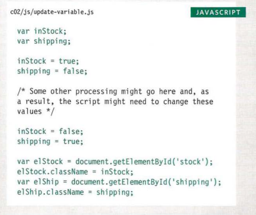


## Decisions and Loops

Loops are a way of repeating the same block of code over and over. They’re incredibly useful, and are used, for example, to carry out an action on every item in an array or in searching.

following picture show type of loop and how can write it:

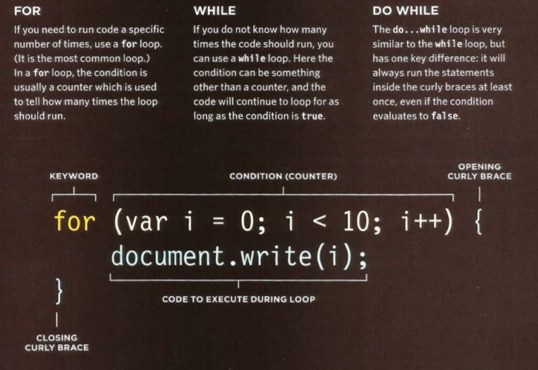


The loop starts with the for keyword, then contains the condition inside the parentheses. As long as the counter is less than the total number of items in the array, the contents of the curly braces will continue to run. Each time the loop runs, the round number is increased by 1.

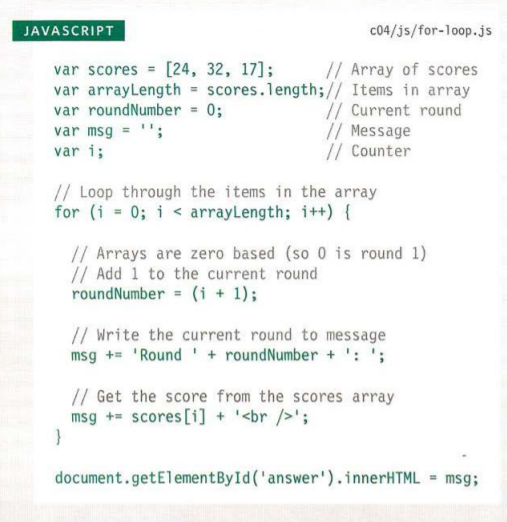

## USING WHILE LOOPS 
This loop will continue to run for as long as the condition in
the parentheses is true.

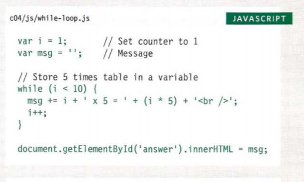

## USI NG DO WHILE LOOPS

The key difference between a whi 1 e loop and a do whi 1 e loop is that the statements in the code block come before the condition. This means that those statements are run once whether or not the condition is met.

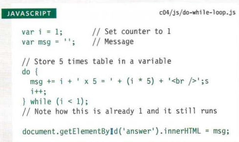

#### After reading this paper please visit [Quiz03](Quiz03.md) and answer the Qustion.
  