# Forms

In addition to enabling users to search, forms also allow users to perform other functions online. You will see forms, when registering as a member of a website, when shopping online, and when signing up for newsletters or mailing lists

## Form Controls

There are several types of form controls that you can use to collect information from visitors to your site.
* ADDING TEXT:
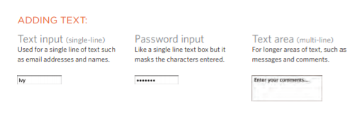

* Making Choices:
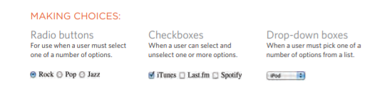

* Submitting Forms// Uploading Files:

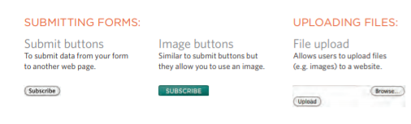

## How Forms Work

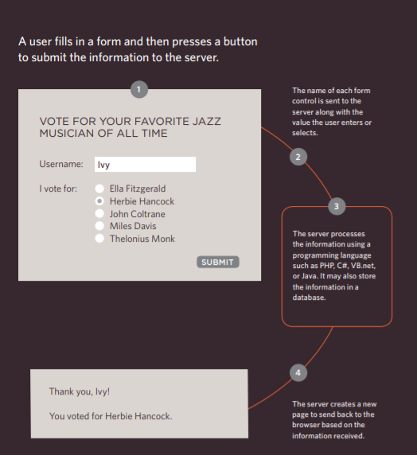

## Form Structure

## <form>

Form controls live inside a <form> element. This element should always carry the action attribute and will usually have a method and id attribute too

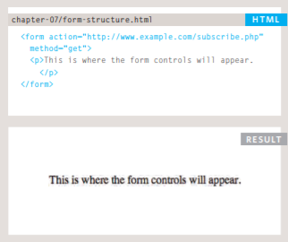

## Text Input

## <input 
The element is used to create several different form controls. The value of the type attribute determines what kind of input they will be creating.

## type="text"
When the type attribute has a value of text, it creates a singleline text input.

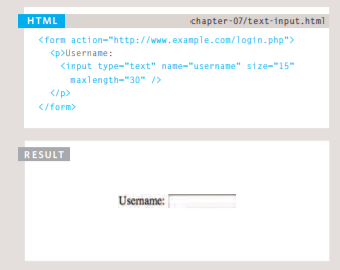

## Password Input

 type="password" When the type attribute has a value of password it creates a text box that acts just like a single-line text input, except the characters are blocked out. They are hidden in this way so that if someone is looking over the user's shoulder, they cannot see sensitive data such as passwords

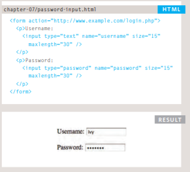

## Text Area

The element is used to create a mutli-line text input. Unlike other input elements this is not an empty element. It should therefore have an opening and a closing tag.

## Radio Button

<input
type radio"
Radio buttons allow users to pick
just one of a number of options.

* name

* value

* checked

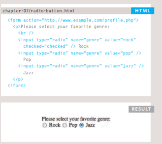

## Checkbox

<input>
type="checkbox"
Checkboxes allow users to select
(and unselect) one or more
options in answer to a question.

* name
* value
* checked

 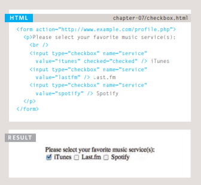

## Drop Down List Box

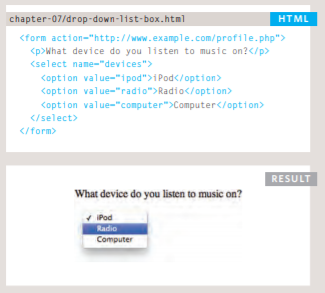

## Multiple Select Box

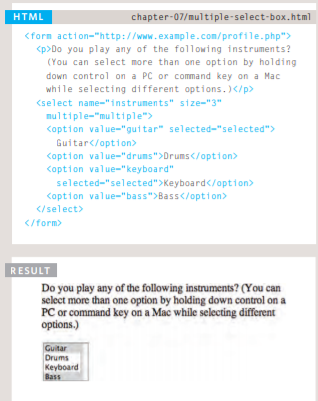

## HTML5: Email & URL Input

<input

* type="email"

* type="url"

 

* Whenever you want to collect information from visitors you will need a form, which lives inside a <form> element. 

* Information from a form is sent in name/value pairs. X Each form control is given a name, and the text the user types in or the values of the options they select are sent to the server.

* HTML5 introduces new form elements which make it easier for visitors to fill in forms.

## Lists, Tables and Forms

### Bullet Point Styles

## list-style-type

* Unordered Lists
For an unordered list you can use the following values:

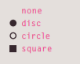

* Ordered Lists
For an ordered (numbered) list you can use the following values:

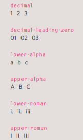

* list-style-image

You can specify an image to actas a bullet point using the list-style-image property

This property can be used on
rules that apply to the <ul> and
<li> elements.

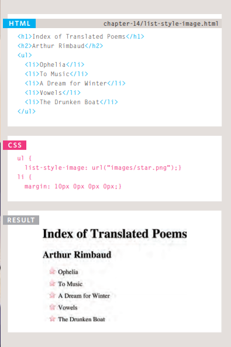

## Styling Forms

CSS is commonly used to control the appearance of form elements. This is both to make them more attractive and to make them more consistent across different browsers

 It is most common to style:
● Text inputs and text areas 
● Submit buttons
● Labels on forms, to get the form controls to align nicely

 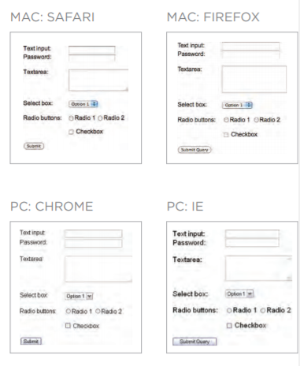

## Events

## DIFFERENT EVENT TYPES 

Here is a selection of the events that occur in the browser while you are browsing the web. Any of these events can be used to trigger a  function in your JavaScript code.

 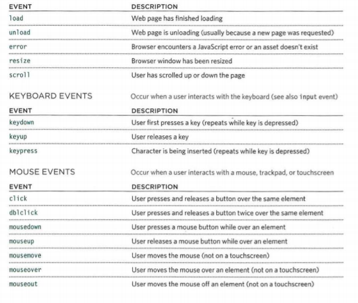

## HOW EVENTS TRIGGER JAVASCRIPT CODE 

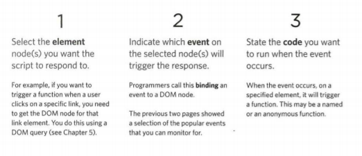

## TRADITIONAL DOM EVENT HANDLERS 

Here is the syntax to bind an event  to an element using an event handler, and to indicate which function should execute when that event fires: 

 

## EVENT LISTENERS

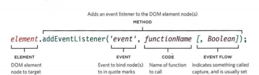

### MOUSE EVENTS 
 ### The mouse events are fired when the mouse is moved and also when its buttons are clicked. 

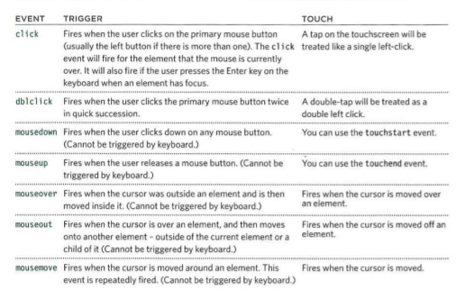

## MUTATION EVENTS & OBSERVERS 

## Whenever elements are added to or removed from the DOM, its structure changes. This change triggers a mutation event. 

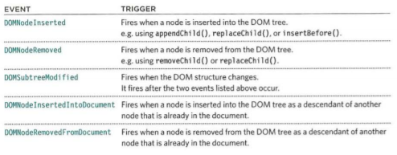

After finish reading pleas click [here](Quiz09.md) to check your information
