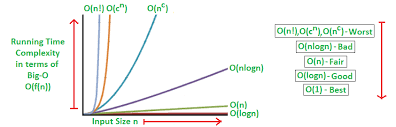

# Big O: Analysis of Algorithm Efficiency

### Big O(oh) notation is used to describe the efficiency of an algorithm or function. 
> 🎉🎉 after finishing reading pls [click here](classQues.md) to test your understading  🎉🎉


This efficiency is evaluated based on 2 factors:

1.Running Time (also known as time efficiency / complexity)
The amount of time a function needs to complete.

2.Memory Space(also known as space efficiency / complexity)The amount of memory resources a function uses to store data and instructions.

# BigO: Worst Case
## BigO(logn)


In order analyze the Space and Time we 
1. Input Size:
Takes the size of each parameter value.
```
Example: If a function uses an array or list as one parameter, then the number of elements within that array or list will directly increase the Input Size of that parameter.
to reperesent input size we use n
```
2. Units of Measurement:

* To Measurements time we use in order to quantify the Running Time:

1. The time in milliseconds from the start of a function execution until it ends.
2. The number of operations that are executed.
3. The number of “Basic Operations” that are executed.

* The Four Sources of Memory Usage during function run-time in order to quantify Memory Space:
1. The amount of space needed to hold the code for the algorithm.
2. The amount of space needed to hold the input data.
3. The amount of space needed for the output data.
4. The amount of space needed to hold working space during the calculation.

3. Orders of Growth
>The Order of Growth represents the increase in Running Time or Memory Space.
 following table in row represent row cell contains the value for Running Time or Memory Space. 


* Constant Complexity: Complexity describes an algorithm that will always execute in the same time (or space) regardless of the size of the input data set. 
```
ALGORITHM Sum(number a, number b)

   number val <-- a + b
   return val
```
* Logarithmic Complexity:omplexity refers to an algorithm that runs in proportionally to the logarithm of the input size.


* Linearithmic Complexity: we can growth rate of n by lgn, linearithmic function grow faster than input size n.


Quadratic Complexity:describes an algorithm with complexity growing at a rate of input size n multiplied by n


* Cubic Complexity:is typically just a higher degree of what makes the quadratic complexity grow at such a high rate.


* Exponential Complexity:represents very rapidly growing complexity, such that whatever our input size n.


* Factorial Complexity:means that the our space and time requirements grow extremely fast, relative to our input size.


3. Orders of Growth

4. Best Case, Worst Case, and Average Case 
 * Worst Case: The efficiency for the worst possible input of size n
 * Best Case: The efficiency for the best possible input of size n
 * Average Case: The efficiency for a “typical” or “random” input of size n

What is a Linked List?


### List
Lists are used to store multiple items in a single variable.

## Terminology:
1. Linked List - A data structure that contains nodes that links/points to the next node in the list.
2. Singly - Singly refers to the number of references the node has. 
3. Doubly - Doubly refers to there being two (double) references within the node. 
4. Node - Nodes are the individual items/links that live in a linked list.
5. Next - Each node contains a property called Next. This property contains the reference to the next node.
6. Head - The Head is a reference of type Node to the first node in a linked list.
7. Current - The Current is a reference of type Node to the node that is currently being looked at. 

## What does it look like


linear data structures:
In linear data structure, data elements are sequentially connected and each element is traversable through a single run.
non-linear data structures: 
In non-linear data structure, data elements are hierarchically connected and are present at various levels.


# Memory management
Memory allocation is the process of setting aside sections of memory in a program to be used to store variables, and instances of structures and classes.


 static data structures:
 Static Data Structure means set of data, but that does not mean that we cannot change the assigned value of elements.

  dynamic data structures:
  There are many situation where the number of items to be stored is not known before hand. In this case we use dynamic data structure.

# Parts of a linked list:
A linked list is made up of a series of nodes, which are the elements of the list.

  

   A single node is also pretty simple. It has just two parts: data, or the information that the node contains, and a reference to the next node.

   # Lists for all shapes and sizes
    

    * Singly linked lists:are the simplest type of linked list, based solely on the fact that they only go in one direction. 

    * doubly linked list:because there are two references contained within each node: a reference to the next node, as well as the previous node.

    * circular linked list is a little odd in that it doesn’t end with a node pointing to a null value.

# Hey, so, what even is Big O?
Big O notation is a mathematical notation that describes the limiting behavior of a function when the argument tends towards a particular value or infinity.

There are two point effect when calculate algorithm performs:
1. how much time it requires at runtime 
2.  how much time and memory it needs.


##  the two types of Big O equations to remember are O(1) and O(n).


* O(1) function:
takes constant time, which is to say that it doesn’t matter how many elements we have, or how huge our input is: it’ll always take the same amount of time and memory to run our algorithm.

* O(n) function:
 is linear, which means that as our input grows, the space and time that we need to run that algorithm grows linearly.

* O(n²) function:
   which clearly takes exponentially more time and memory the more elements that you have.

## Growing a linked list

1. First, we find the head node of the linked list.
2. Next, we’ll make our new node, and set its pointer to the current first node of the list.
3. Lastly, we rearrange our head node’s pointer to point at our new node.

> Note If we accidentally end up doing step 3 before step 2, we’d end up in a cyclical structure.

Inserting an element at the beginning of a linked list it takes the same amount of time, no matter how long our list is, which is to say it has:
 a space time complexity that is constant, or O(1).

 

 ### inserting an element at the end of a linked list 

1. Find the node we want to change the pointer of (in this case, the last node)
2. Create the new node we want to insert and set its pointer (in this case, to null)
3. Direct the preceding node’s pointer to our new node

space time complexity adding something after the last node .Which means that we’ll need to traverse through the entire linked list to find it: a linear O(n) 


## To list or not to list?

A good rule of thumb for remember the characteristics of linked lists is this:
1. linked list is usually efficient when it comes to adding and removing most elements.
2. be very slow to search and find a single element.

>If you ever find yourself having to do something that requires a lot of traversal, iteration, or quick index-level access, a linked list could be your worst enemy. 

for that an array might be a better solution, since you can find things quickly (a single chunk of allocated memory).

## array VS a linked list


🎉🎉 after finishing reading pls [click here](classQues.md) to test your understading  🎉🎉