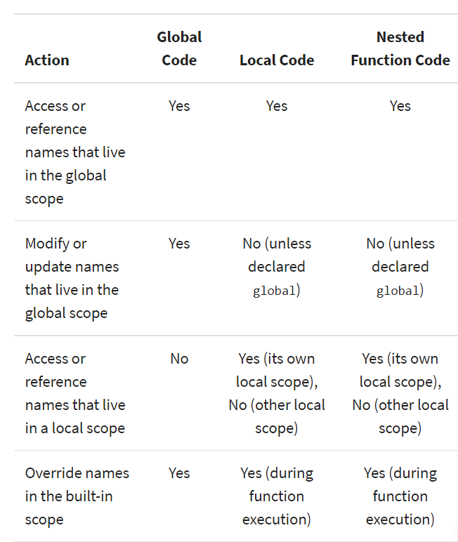

## Python Scope & the LEGB Rule: Resolving Names in Your Code


#### Understanding Scope

The concept of scope rules how variables and names are looked up in your code.
The Python scope concept is generally presented using a rule known as the LEGB rule.

> LEGB stand for Local, Enclosing, Global, and Built-in scopes.

You can take advantage of Python scopes to write more reliable and maintainable programs. 

Scope of a name defines the area of a program in which you can unambiguously access that name.

Such as variables, functions, objects, and so on. 

Several programming languages take advantage of scope for avoiding name collisions and unpredictable behaviors. 

Most commonly, you’ll distinguish two general scopes:
1. Global scope: The names that you define in this scope are available to all your code.

2. Local scope: The names that you define in this scope are only available or visible to the code within the scope.


## Names and Scopes in Python

 Python is a dynamically-typed language, variables in Python come into existence when you first assign them a value.
 ```
>  functions and classes are available after you define them using def or class, respectively.
>  modules exist after you import them.
 ```

If you assign a value to a **name** inside a function, then that name will have a local Python scope. 


## Python Scope vs Namespace
> In Python, the concept of scope is closely related to the concept of the namespace.
> Python scopes are implemented as dictionaries that map names to objects.
> These dictionaries are commonly called namespaces. 

Then you can reference ps1 in at least two different ways:

1. Using the dot notation on the module’s name in the form module.name
2. Using a subscription operation on .__dict__ in the form module.__dict__['name']

```
>>> sys.ps1
'>>> '
>>> sys.__dict__['ps1']
'>>> '
```
## Using the LEGB Rule for Python Scope
LEGB rule: Python resolves names using the so-called 

### Here’s a quick overview of what these terms mean:
* Local (or function) scope:is the code block or body of any Python function or lambda expression.

* Enclosing (or nonlocal) scope:is a special scope that only exists for nested functions.

* Global (or module) scope:is the top-most scope in a Python program, script, or module. 

* Built-in scope: is a special Python scope that’s created or loaded whenever you run a script or open an interactive session. 

> Note: Notice that the local and enclosing Python scopes are searched only if you use a name inside a function (local scope) or a nested or inner function (local and enclosing scope).

## Functions: The Local Scope
 * The local scope or function scope is a Python scope created at function calls. Every time you call a function, you’re also creating a new local scope. 

 ## Nested Functions: The Enclosing Scope
* Enclosing or nonlocal scope is observed when you nest functions inside other functions.

## Modules: The Global Scope
From the moment you start a Python program, you’re in the global Python scope. 

* Whenever you assign a value to a name in Python, one of two things can happen:

1. You create a new name
2. You update an existing name


```
Modifying global names is generally considered bad programming practice because it can lead to code that is:

* Difficult to debug: Almost any statement in the program can change the value of a global name.
* Hard to understand: You need to be aware of all the statements that access and modify global names.
* Impossible to reuse: The code is dependent on global names that are specific to a concrete program.
```

Following the LEGB rule, you’ll look up number in the following places:

1. Inside inner_func(): This is the local scope, but number doesn’t exist there.
2. Inside outer_func(): This is the enclosing scope, but number isn’t defined there either.
3. In the module scope: This is the global scope, and you find number there, so you can print number to the screen.

```
Good programming practice recommends using local names rather than global names. Here are some tips:

1. Write self-contained functions that rely on local names rather than global ones.
2. Try to use unique objects names, no matter what scope you’re in.
3. Avoid global name modifications throughout your programs.
4. Avoid cross-module name modifications.
5. Use global names as constants that don’t change during your program’s execution.
```

### builtins: The Built-In Scope

The built-in scope is a special Python scope that’s implemented as a standard library module named builtins in Python 3.x. All of Python’s built-in objects live in this module. 


### Modifying the Behavior of a Python Scope
* global names you can access or reference them  from any place in your code.

* local names you access only from inside the local Python scope they were created in or from inside a nested function

Python provides two keywords that allow you to modify the content of global and nonlocal names:

1. global: you create a new local name in the function scope. 
```
>>> counter = 0  # A global name
>>> def update_counter():
...     counter = counter + 1  # Fail trying to update counter
...
>>> update_counter()
Traceback (most recent call last):
  File "<stdin>", line 1, in <module>
  File "<stdin>", line 2, in update_counter
UnboundLocalError: local variable 'counter' referenced before assignment
```

2. nonlocal: nonlocal names can be accessed from inner functions, but not assigned or updated. 

>pov: nonlocal keyword followed by one or more names separated by commas. 


### Using Enclosing Scopes as Closures

**Closures** are a special use case of the enclosing Python scope. When you handle a nested function as data.

>pov: Note: You can also call this kind of function a factory, a factory function, or—to be more precise—a closure factory

### Bringing Names to Scope With import

* When you write a Python program, you typically organize the code into several modules.:
    you need to bring the names in those separate modules to your __main__ module.
* To do that, you need to import the modules or the names explicitly. 

### Discovering Unusual Python Scopes

You’ll find some Python structures where name resolution seems not to fit into the LEGB rule for Python scopes. These structures include:

1. Comprehensions: 
 A comprehension is a compact way to process all or part of the elements in a collection or sequence. You can use comprehensions to create lists, dictionaries, and sets.

```
>>> [item for item in range(5)]
[0, 1, 2, 3, 4]
>>> item  # Try to access the comprehension variable
Traceback (most recent call last):
  File "<stdin>", line 1, in <module>
    item
NameError: name 'item' is not defined
```

2. Exception blocks: 
The exception variable is a variable that holds a reference to the exception raised by a try statement.such variables are local to the except block and are forgotten when the block ends. 

3. Classes and instances:
creating a new local Python scope. The names assigned at the top level of the class live in this local scope. 
```
>>> class A:
...     var = 100
...     def print_var(self):
...         print(var)  # Try to access a class attribute directly
...
>>> A().print_var()
Traceback (most recent call last):
  File "<stdin>", line 1, in <module>
    A().print_var()
  File "<stdin>", line 4, in print_var
    print(var)
NameError: name 'var' is not defined
```

### Using Scope Related Built-In Functions
Python built-in functions to scope and namespaces:

1. globals(): 
 is a built-in function that returns a reference to the current global scope or namespace dictionary. 

 ```
 >>> globals()
{'__name__': '__main__',..., '__builtins__': <module 'builtins' (built-in)>}
>>> my_var = 100
>>> globals()
{'__name__': '__main__',..., 'my_var': 100}
 ```

2. locals(): This function updates and returns a dictionary that holds a copy of the current state of the local Python scope or namespace.

3. vars(): is a Python built-in function that returns the .__dict__ attribute of a module, class, instance, or any other object which has a dictionary attribute. Remember that 
> pov :__dict__ is a special dictionary that Python uses to implement namespaces.

4. dir():
*  dir() without arguments to get the list of names in the current Python scope.
*  If you call dir() with an argument, then the function attempts to return a list of valid attributes for that object

### BIG O notation 
✨Computiatinal Complexity
📈 O(1) - Constant Complexity
📈 O(n) - Linear Complexity
📈 O(n2) - Quadratic Complexity
📈 O(log n) - Logarithmic Complexity
📈 O(n3) - Cubic Complexity
📈 O(n log n) - Linearithmic Complexity
📈 O(2n) - Exponential Complexity
