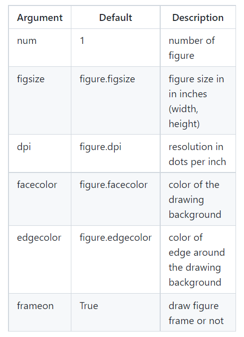
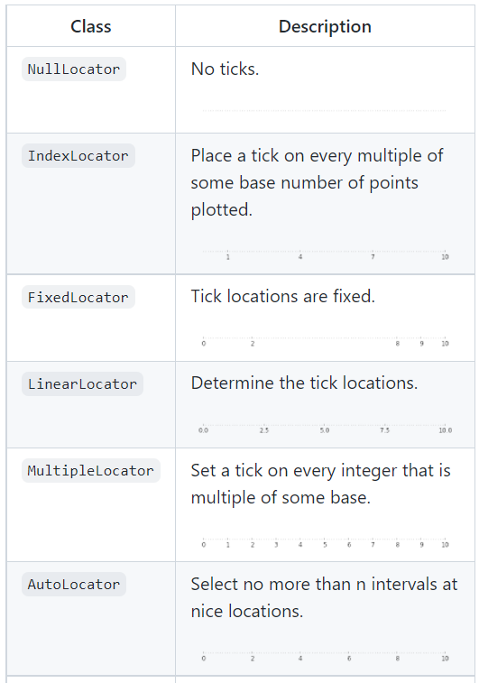

# Introduction
matplotlib is probably the single most used Python package for 2D-graphics. It provides both a very quick way to visualize data from Python and publication-quality figures in many formats.

## IPython and the pylab mode:

* IPython is an enhanced interactive Python shell that has lots of interesting features including named inputs and outputs, access to shell commands, improved debugging and much more. 
* pyplot provides a convenient interface to the matplotlib object-oriented plotting library. It is modeled closely after Matlab(TM). 

#### Simple plot
```
The first step is to get the data for the sine and cosine functions:

import numpy as np

X = np.linspace(-np.pi, np.pi, 256, endpoint=True)
C, S = np.cos(X), np.sin(X)

X is now a NumPy array with 256 values ranging from -π to +π (included).
C is the cosine (256 values) and S is the sine (256 values).
```
* To run the example, you can download each of the examples and run it using:
```
$ python exercice_1.py
```
## Documentation
* plot tutorial
* plot() command


You can control the defaults of almost every property in matplotlib: 
* figure size and dpi
* line width
* color and style
* axis and grid properties
* text and font properties. 


## Instantiating defaults:

* Customizing matplotlib:


## Changing colors and line widths

* Controlling line properties
* Line API


```
plt.figure(figsize=(10,6), dpi=80)
plt.plot(X, C, color="blue", linewidth=2.5, linestyle="-")
# we want to have the cosine in blue
plt.plot(X, S, color="red",  linewidth=2.5, linestyle="-")
# we want to have the cosine in blue and the sine in red and a slightly thicker line for both of them. 

```
## Setting limits

* xlim() command
* ylim() command


```
plt.xlim(X.min()*1.1, X.max()*1.1)
plt.ylim(C.min()*1.1, C.max()*1.1)

# the figure are a bit too tight 
```

## Setting ticks

* xticks() command
* yticks() command
* Tick container
* Tick locating and formatting


```
plt.xticks( [-np.pi, -np.pi/2, 0, np.pi/2, np.pi])
plt.yticks([-1, 0, +1])
```

## Setting tick labels

* Working with text
* xticks() command
* yticks() command
* set_xticklabels()
* set_yticklabels()

## Moving spines

* Spines
* Axis container
* Transformations tutorial


## Adding a legend

* Legend guide
* legend() command
* Legend API

```
plt.plot(X, C, color="blue", linewidth=2.5, linestyle="-", label="cosine")
plt.plot(X, S, color="red",  linewidth=2.5, linestyle="-", label="sine")
# legend only requires adding the keyword argument label to the plot commands.
plt.legend(loc='upper left', frameon=False)

```
## Annotate some points

* Annotating axis
* annotate() command


## Devil is in the details

* Artists
* BBox

```
for label in ax.get_xticklabels() + ax.get_yticklabels():
    label.set_fontsize(16)
    label.set_bbox(dict(facecolor='white', edgecolor='None', alpha=0.65 ))
```

### Figures, Subplots, Axes and Ticks
* Figures
A figure is the windows in the GUI that has "Figure #" as title. Figures are numbered starting from 1 as opposed to the normal Python way starting from 0. This is clearly MATLAB-style. 


* Subplots
With subplot you can arrange plots in a regular grid. You need to specify the number of rows and columns and the number of the plot. 

* Axes
Axes are very similar to subplots but allow placement of plots at any location in the figure. 

* Ticks
Well formatted ticks are an important part of publishing-ready figures. Matplotlib provides a totally configurable system for ticks.

* Tick Locators
There are several locators for different kind of requirements:  


## Animation

* See Animation
The most easy way to make an animation in matplotlib is to declare a FuncAnimation object that specifies to matplotlib what is the figure to update, what is the update function and what is the delay between frames.

* Drip drop
A very simple rain effect can be obtained by having small growing rings randomly positioned over a figure. Of course, they won't grow forever since the wave is supposed to damp with time.


## Other Types of Plots


## Matplotlib benefits from extensive documentation as well as a large community of users and developpe