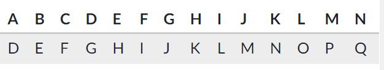

# cryptography:
 The shift cipher, Caesar's code or Caesar shift, is one of the simplest and most widely known encryption techniques. It is a type of substitution cipher in which each letter in the plaintext is replaced by a letter some fixed number of positions down the alphabet.

## Encrypting a message

Imagine Caesar wants to send this message:
```
SECRET MEETING AT THE PALACE
```
Here's what that might look like encrypted:
```
YKIXKZ SKKZOTM GZ ZNK VGRGIK
```

The Caesar Cipher is a simple substitution cipher which replaces each original letter with a different letter in the alphabet by shifting the alphabet by a certain amount.


Now imagine Caesar wants to send the following message, with the same shift of 6:


## Decrypting a message
According to historical records, Caesar always used a shift of 3. As long as his message recipient knew the shift amount, it was trivial for them to decode the message.

Imagine Caesar sends this message to a comrade:
EHZDUH EUXWXV
The comrade uses this substitution table, where the alphabet is shifted by 3:


They can then decode the message with certainty. The first letter "E" was shifted by 3 from "B", the second letter "H" was shifted by 3 from "E", etc. The result is this ominous message:
```
BEWARE BRUTUS
```


## Frequency analysis
Human languages tend to use some letters more than others. For example, "E" is the most popular letter in the English language. 
We can analyze the frequency of the characters in the message and identify the most likely "E" and narrow down the possible shift amounts based on that.

## Known plaintext
Another term for the original unencrypted message is plaintext. If the enemy already knew some part of the plaintext, it will be easier for them to crack the rest of the encrypted version.

## Brute force
There are only 25 possible shifts (not 26 — why not?). The enemy could take some time to try out each of them and find one that yielded a sensible message. 


## Encryption, decryption, and cracking

There are three key aspects of data encryption:

* Encryption: scrambling the data according to a secret key (in this case, the alphabet shift).

* Decryption: recovering the original data from scrambled data by using the secret key.

* Code cracking: uncovering the original data without knowing the secret, by using a variety of clever techniques.


