# Introduction

Try out and download all of the code for this book online [click here](http://www.htmlandcssbook.com/code/)

# HTML
is used to create web pages. You will see that you start by writing down the words you want to appear on your page.

# CSS
uses rules to enable you to control the styling and layout of web pages. 
We then go on to look at the wide variety of CSS properties you can use in your CSS rules. These properties generally fall into one of two categories:
* Presentation: How to control things like the color of text, the fonts you want to use and the size of those fonts, how to add background colors to pages (or parts of a page), and how to add background images.
* Layout: How to control where the different elements are positioned on the screen. You will also learn several techniques that professionals use to make their pages more attractive.

# How the Web Works

When you visit a website, the web server hosting that site could be anywhere in the world. In order for you to find the location of the web server, your browser will first connect to a Domain Name System (DNS) server


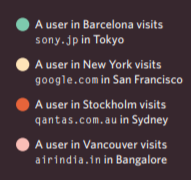

###  You can see the HTML code:
```
<html>
<body>
 <h1>This is the Main Heading</h1>
 <p>This text might be an introduction to the rest of
 the page. And if the page is a long one it might
 be split up into several sub-headings.<p>
 <h2>This is a Sub-Heading</h2>
 <p>Many long articles have sub-headings so to help
 you follow the structure of what is being written.
 There may even be sub-sub-headings (or lower-level
 headings).</p>
 <h2>Another Sub-Heading</h2>
 <p>Here you can see another sub-heading.</p>
</body>
</html>

```
Following page result for debug html code:
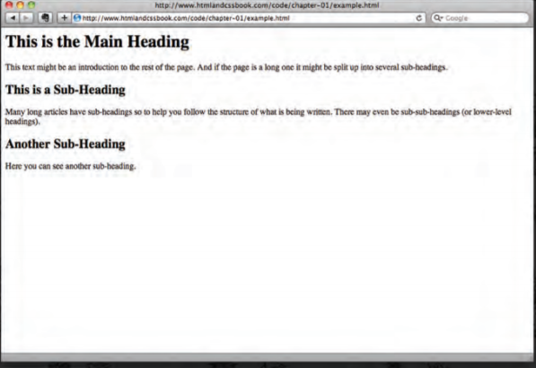


## HTML Uses Elements to Describe the Structure of Pages

>Let's look closer at the code.
There are several different elements. Each
element has an opening tag and a closing tag ,as following picture.


### CODE STRUCTURE
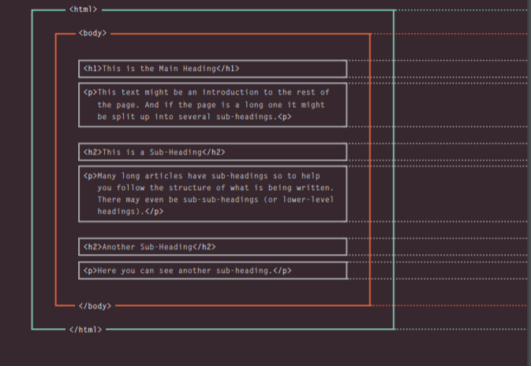

>Tags act like containers. They tell you
something about the information that lies
between their opening and closing tags.

 following picture to describe these tags 
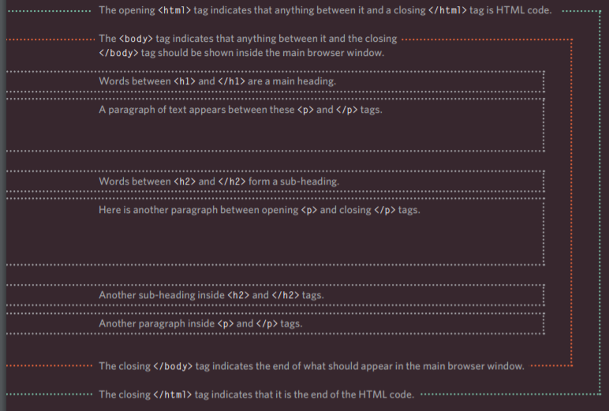

# A Closer Look at Tags
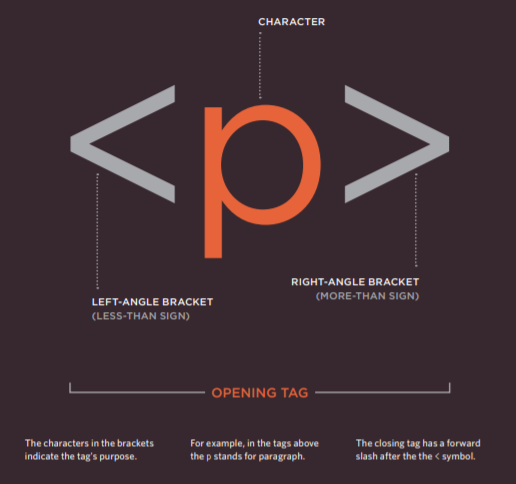


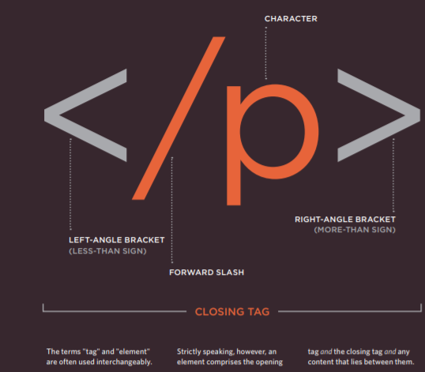

# Attributes Tell Us More About Elements

Attributes provide additional information about the contents of an element. They appear on the opening tag of the element and are made up of two parts: * a name * and * a value *, separated by an equals sign.

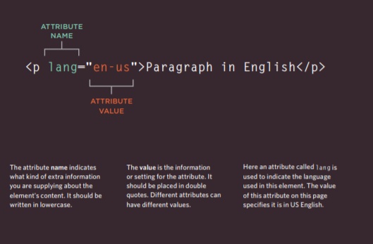

HTML5 allows you to use uppercase attribute names and omit the quotemarks, but this is not recommended.

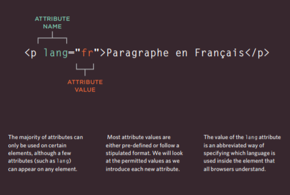

# Body, Head & Title

## <body>
 You met the <body> element in the first example we created. Everything inside this element is shown inside the main browser window.
## <head>
  Before the <body> element you will often see a <head> element. This contains information about the page (rather than information that is shown within the main part of the browser window that is highlighted in blue on the opposite page). You will usually find a <title> element inside the <head> element.
## <title>
 The contents of the <title> element are either shown in the top of the browser, above where you usually type in the URL of the page you want to visit, or on the tab for that page (if your browser uses tabs to allow you to view multiple pages at the same time).

 following you can see code Html and result page and discription for the result page:

 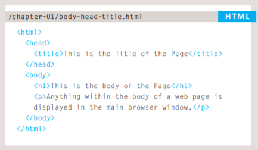

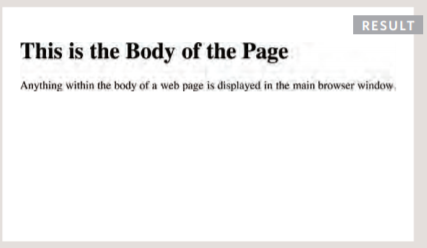

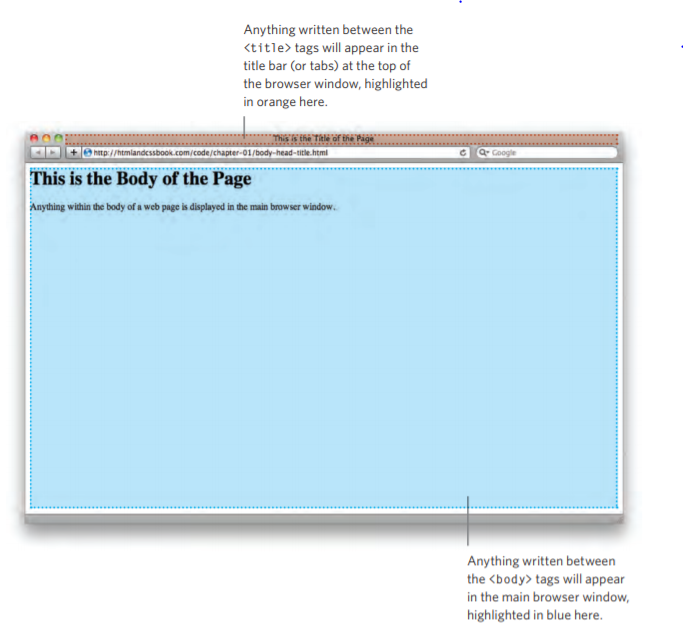

# ExtraMarkup

* Specifying different versions of HTML
* Identifying and grouping elements
* Comments, meta information and iframes
# DOCTYPES 
DOCTYPES tell browsers which version of HTML you are using.

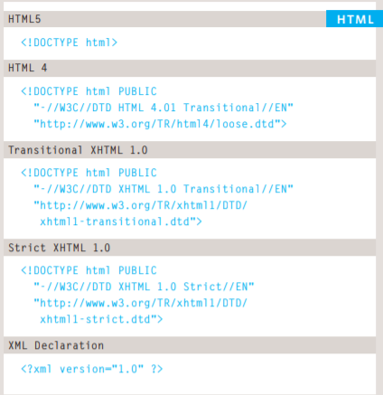

# Comments in HTML
You can add comments to your code between the <!-- and --> markers.

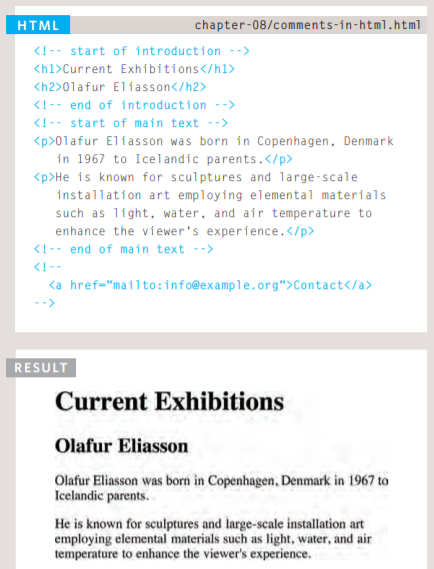

# ID Attribute && Class Attribute

The id and class attributes allow you to identify particular elements.
id always used to specific element.
class ucually used for group of element.

ID example:

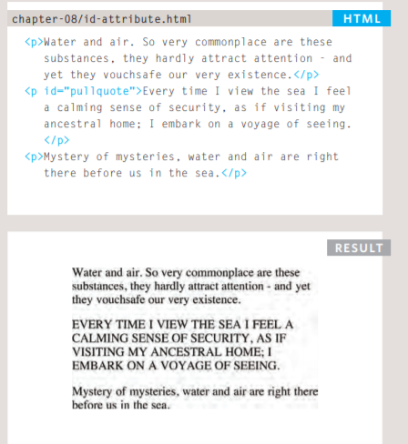


class example:

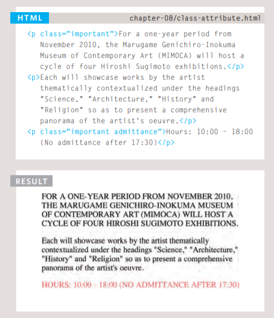

# Block Elements

Some elements will always appear to start on a new line in the browser window. These are known as block level elements. 
>Examples of block elements are <h1>, <p>, <ul>, and <li>

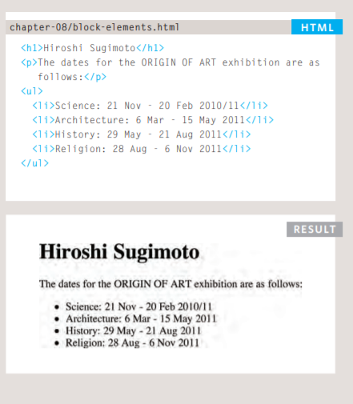

# Inline Elements

tml Some elements will always appear to continue on the same line as their neighbouring elements. These are known as inline elements. 
Examples of inline elements are <a>, <b>, <em>, and .

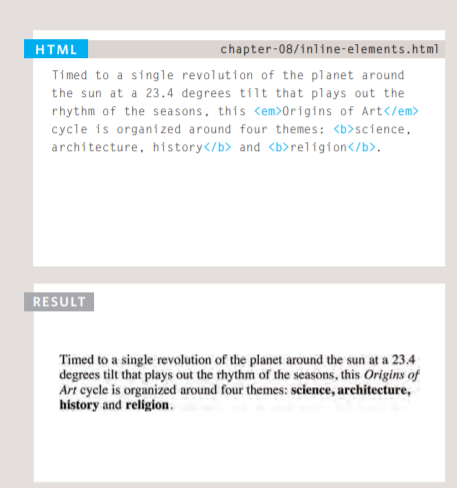

# Grouping Text & Elements In a Block

# <div> 
The <div> element allows you to group a set of elements together
in one block-level box.

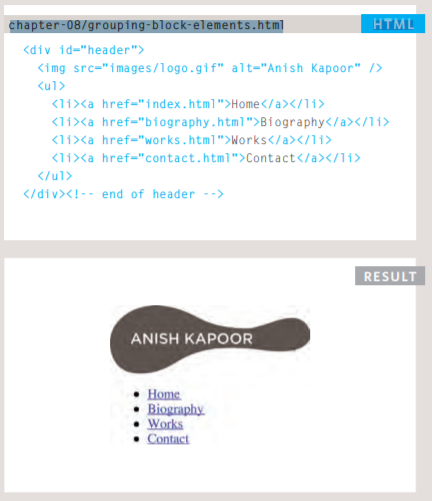

# <span> 
The <span> element acts like an inline equivalent of the <div> element. It is used to either:

 1. Contain a section of text where there is no other suitable element to differentiate it from its surrounding text. 
 2. Contain a number of inline elements

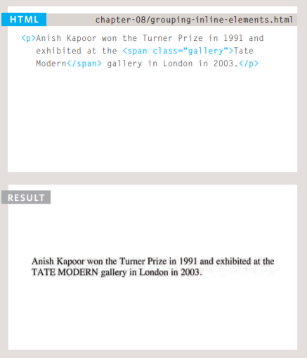

# <iframes> 

cut windows into your web pages through which other pages can be displayed.

An iframe is created using the <iframe> element. There are a few attributes that you will need to know to use it:

### src
 The src attribute specifies the URL of the page to show in the frame.
### height 
 The height attribute specifies the height of the iframe in pixels. 
### width
  The width attribute specifies the width of the iframe in pixels.

### scrolling
The scrolling attribute will not be supported in HTML5. In HTML 4 and XHTML, it indicates whether the iframe should have scrollbars or not. This is important if the page inside the iframe is larger than the space you have allowed for it (using the height and width attributes).

### frameborder 
The frameborder attribute will not be supported in HTML5. In HTML 4 and XHTML, it indicates whether the frame should have a border or not. A value of 0 indicates that no border should be shown. A value of 1 indicates that a border should be shown.

### seamless
In HTML5, a new attribute called seamless can be applied to an iframe where scrollbars are not desired. The seamless attribute (like some other new HTML5 attributes) does not need a value, but you will often see authors give it a value of seamless.

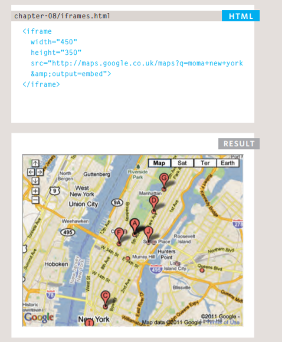 

# <meta>
The <meta> element lives inside the <head> element and contains information about that web page. It is not visible to users but fulfills a number of purposes such as telling search engines about your page, who created it, and whether or not it is time sensitive. (If the page is time sensitive, it can be set to expire.) The <meta> element is an empty element so it does not have a closing tag. It uses attributes to carry the information.

The value of the name attribute can be anything you want it to be. Some defined values for this attribute that are commonly used are: 

### description 
This contains a description of the page. This description is commonly used by search engines to understand what the page is about and should be a maximum of 155 characters. Sometimes it is also displayed in search engine results. 

### keywords 
This contains a list of commaseparated words that a user might search on to find the page. In practice, this no longer has any noticeable effect on how search engines index your site.

### robots 
This indicates whether search engines should add this page to their search results or not. A value of noindex can be used if this page should not be added. A value of nofollow can be used if search engines should add this page in their results but not any pages that it links to.

### author 
This defines the author of the web page.
### pragma 
This prevents the browser from caching the page.
### expires
 Because browsers often cache the content of a page, the expires option can be used to indicate when the page should expire (and no longer be cached). Note that the date must be specified in the format shown.

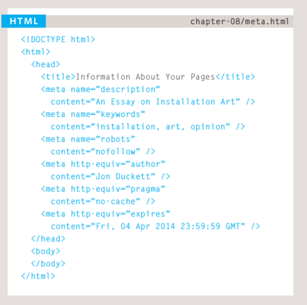 

###  Escape characters 
are used to include special characters in your pages such as <, >, and ©.

# HTML5 Layout

#### HTML5 is introducing a new set of elements that help define the structure of a page.


### Traditional HTML Layouts

>For a long time, web page authors used <div> elements to group together related elements on the page (such as the elements that form a header, an article, footer or sidebar). Authors used class or id attributes to indicate the role of the <div> element in the structure of the page.

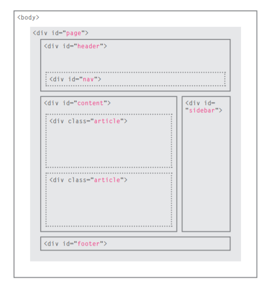 

### New Html5 Layout Elements

>HTML5 introduces a new set of elements that allow you to divide up the parts of a page. The names of these elements indicate the kind of content you will find in them. They are still subject to change, but that has not stopped many web page authors using them already.

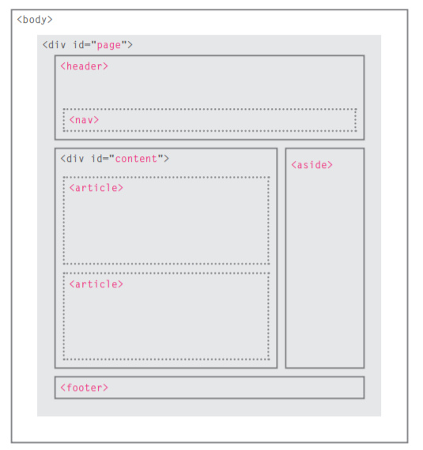 

# Headers & Footers
## <header> <footer>

>The <header> and <footer> elements can be used for:

 >* The main header or footer that appears at the top or bottom of every page on the site. 
 
>* A header or footer for an individual <article> or <section> within the page.

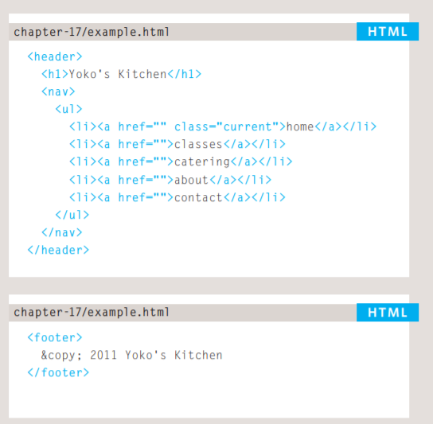 

# Navigation
## <nav>
>The <nav> element is used to contain the major navigational
blocks on the site such as the primary site navigation.

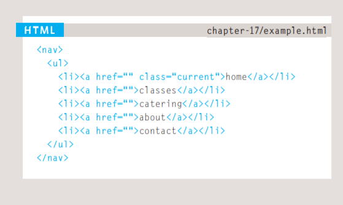

# Articles
## <article>

The <article> element acts as a container for any section of a page that could stand alone and potentially be syndicated.

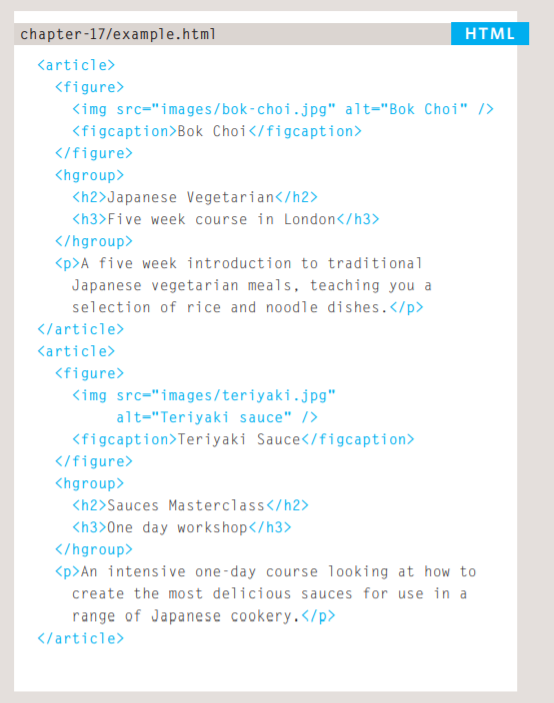

# Article
## <aside>
>When the <aside> element is used inside an <article> element, it should contain information that is related to the article but not essential to its overall meaning. For example, a pullquote or glossary might be considered as an aside to the article it relates to.

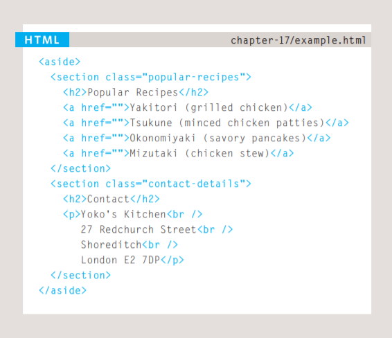

# Sections
## <section>

>The <section> element groups related content together, and typically each section would have its own heading.

>The <section> element should not be used as a wrapper for the entire page (unless the page only contains one distinct piece of content). If you want a containing element for the entire page, that job is still best left to the <div> element.

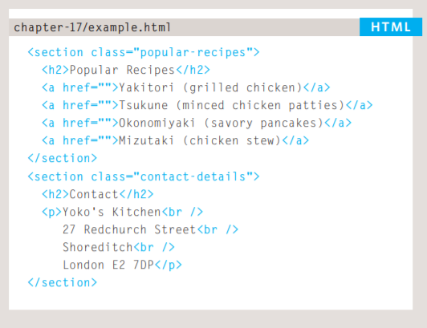

# Heading Groups
## <hgroup>

> This element has had a mixed reception. When it was first proposed by the people developing HTML5, there were some complaints and it was withdrawn from the HTML5 proposals. However, some people changed their minds and it has been added it back into the language. Some developers do not like the use of the <hgroup> element, and prefer to place a subtitle inside a <p> element (using an attribute to indicate that it is a subheading). Some suggest that it is of little use other than as a styling hook. It has, however, been popular with those developers who believe that it is useful to group together the primary heading and the subheading (as both can be integral parts of a heading).

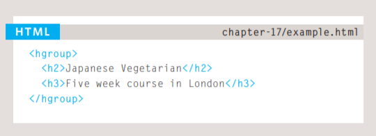

# Figures
## <figure> <figcaption>

>It is important to note that the article should still make sense if the content of the <figure> element were moved (to another part of the page, or even to a different page altogether). 

>For this reason, it should only be used when the content simply references the element (and not for something that is absolutely integral to the flow of a page). Examples of usage include:(Images,Videos ,Graphs...etc)

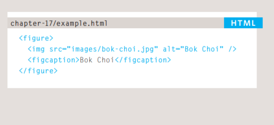

# Process & Design

#### It's important to understand who your target audience is, why they would come to your site, what information they want to find and when they are likely to return.

It can be helpful to ask some questions about the people you would expect to be interested in the subject of your site, and these following qustion is for individuals or company to detremine how you should built you web page.

#### Target Audience: individuals
● What is the age range of your target audience?

● Will your site appeal to more women or men? What is the mix?

● Which country do your visitors live in?

● Do they live in urban or rural areas?

● What is the average income of visitors?

● What level of education do they have?

● What is their marital or family status?

● What is their occupation?

● How many hours do they work per week?

● How often do they use the web?

● What kind of device do they use to access the web?

#### Target Audience: Companies

● What is the size of the company or relevant department?

● What is the position of people in the company who visit your site?

● Will visitors be using the site for themselves or for someone else?

● How large is the budget they control?

# Why People Visit YOUR Website

#### Now that you know who your visitors are, you need to consider why they are coming. While some people will simply chance across your website, most will visit for a specific reason.

To help determine why people are coming to your website,
there are two basic categories of questions you can ask:

1: The first attempts to discover the underlying *motivations* for
why visitors come to the site. 

2: The second examines the specific *goals* of the visitors.
These are the triggers making them come to the site now.


### Key Motivations
● Are they looking for general entertainment or do they need to achieve a specific goal?

● If there is a specific goal, is it a personal or professional
one?

● Do they see spending time on this activity as essential or a
luxury?

### Key Information
 ● Will visitors be familiar with your subject area / brand or do you need to introduce yourself?

  ● Will they be familiar with the product / service / information you are covering or do they need background information on it?

   ● What are the most important features of what you are offering?

   ● What is special about what you offer that differentiates you from other sites that offer something similar? 
   
   ● Once people have achieved the goal that sent them to your site, are there common questions people ask about this subject area?


# How Often People Will Visit Your Site

Some sites benefit from being updated more frequently than others. Some information (such as news) may be constantly changing, while
other content remains relatively static.

Here are some questions to help you decide how often to update your website content...
# Goods / Services 

● How often do the same people return to purchase from you? 

● How often is your stock updated or your service changed?
 # Information 
 ● How often is the subject updated? 

● What percentage of your visitors would return for regular updates on the subject, compared with those who will just need the information once?


# Site Maps
Now that you know what needs to appear on your site, you can start to organize the information into sections or pages.

# Example Site Map

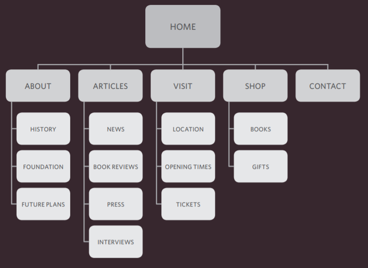

# wireframes
>A wireframe is a simple sketch of the key
information that needs to go on each page of a
site. It shows the hierarchy of the information
and how much space it might require

The wireframes make design easier because you know what information needs to appear on which page before considering how the the page should look. It can be very helpful to show the wireframes of a site to a client before showing them a design. It enables the client to ensure the site has all the functions and information it needs to offer.

### Example Wireframe
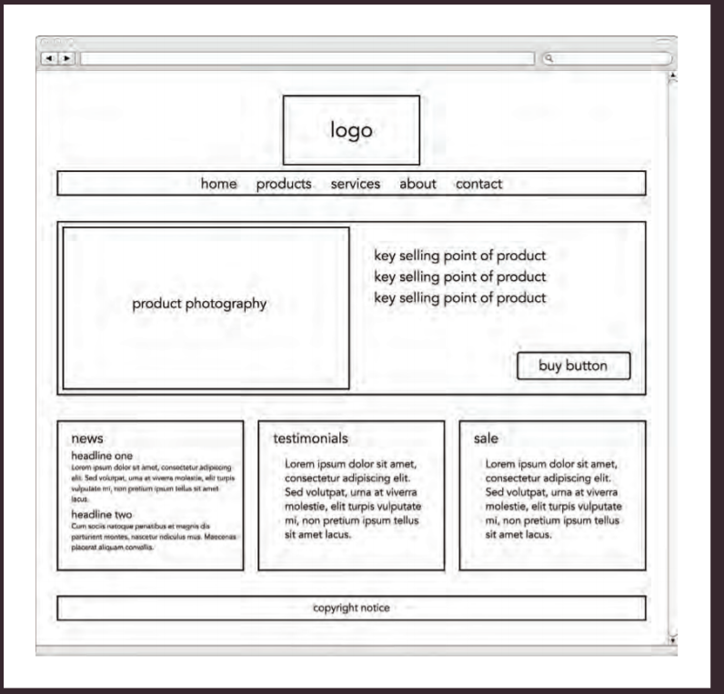

# Getting your message across using design

### The primary aim of any kind of visual design is to communicate. Organizing and prioritizing information on a page helps users understand its importance and what order to read it in.

#### CONTENT
 Web pages often have a lot of information to communicate. For example, the pages of online newspapers will have information that does not appear on every page of the print equivalent:

● A masthead or logo 

● Links to navigate the site

● Links to related content and other popular articles

● Login or membership options

● Ability for users to comment

● Copyright information

● Links to privacy policies,terms and conditions,advertising information, RSSfeeds, subscription options

>With so much on the page, the designer needs to *organize* and *prioritize* the information to communicate their message and help users find what they're looking for.

## Prioritizing
 If everything on a page appeared in the same style, it would be much harder to understand. (Key messages would not stand out.) 

 By making parts of the page look **distinct **from surrounding content, designers draw attention to (or away from) those items.

 Designers create something known as a** visual hierarchy** to help users focus on the key messages that will draw people's attention, and then guide them to subsequent messages. 
 
 # Organizing 
 **Grouping ** together related content into ** blocks or chunks** makes the page look simpler (and easier to understand). Users should be able to identify the purpose of each block without processing each individual item. By presenting certain types of information in a **similar ** visual style (such as using the same style for all buttons or all links), users will learn to associate that style with a particular type of content.

> Let's look at an example of how design can be used to effectively communicate the services of a company.


 
 # Visual hierarchy

### Most web users do not read entire pages. Rather, they skim to find information. You can use contrast to create a visual hierarchy that gets across your key message and helps users find what they are looking for.
 
 # SIZE
 Larger elements will grab users' attention first. For this reason it is a good idea to make headings and key points relatively large.
 
 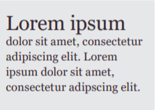
 
 # COLOR 
 Foreground and background color can draw attention to key messages. Brighter sections tend to draw users' attention first. 
 
 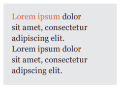
 
 # Style
 An element may be the same size and color as surrounding content but have a different style applied to it to make it stand out
 
 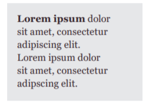
 
 # Images
 Images create a high visual contrast and often attract the eye first. They can be used to draw attention to a specific message within the page. In some cases, the right image can succinctly reveal more than an entire page of text.
 
 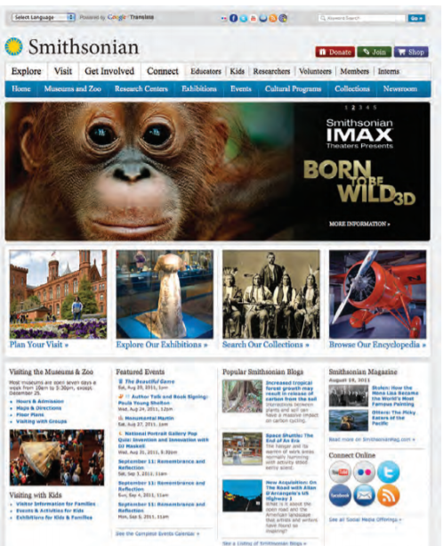
 
 
 # JAVASCRIPT & JQUERY
  
 This book explains how JavaScript can be used in browsers to make websites more interactive, interesting, and user-friendly. You will also learn about jQuery because it makes writing JavaScript a lot easier.
 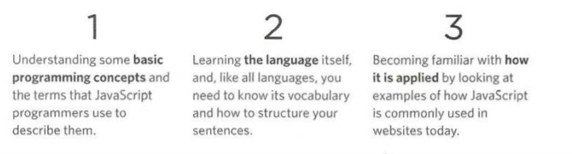
 
## How JavaScript Makes Web Pages More Interactive

1 ACCESS CONTENT
 You can use JavaScript to select any element, attribute, or text from an HTML page. 
 
 2 MODIFY CONTENT
You can use JavaScript to add elements, attributes, and text to the page, or remove them. 
 
 3 PROGRAM RULES
You can specify a set of steps for the browser to follow (like a recipe), which allows it to access or change the content of a page
 
 4 REACT TO EVENTS 

 You can specify that a script should run when a specific event has occurred. 
 
 # The ABC of Programming
 
 >Before you learn how to read and write the JavaScript language itself, you need to become familiar with some key concepts in computer programming. They will be covered in three sections:
 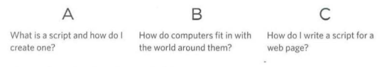
 
 # What Is A Script And How Do I Create One?
 
 >A script is a series of instructions that a computer can follow to achieve a goal. You could compare scripts to any of the following: 
 
 #### RECIPES
 By following the instructions in a recipe, one-by-one in the order set out, cooks can create a dish they have never made before.
 
 ##### WRITING A SCRIPT 
 
 > To write a script, you need to first state your goal and then list the tasks that need to be completed in order to achieve it.
 
### Start with the big picture of what
you want to achieve, and break that down into smaller steps.
 
1. DEFINE THE GOAL 
 First, you need to define the task you want to achieve. You can think of this as a puzzle for the computer to solve.
 
2. DESIGN THE SCRIPT
To design a script you split the goal out into a series of tasks that are going to be involved in solving this puzzle. This can be represented using a flowchart. You can then write down individual steps that the computer needs to perform in order to complete each individual task (and any information it needs to perform the task), rather like writing a recipe that it can follow.
 
3. CODE EACH STEP
Each of the steps needs to be written in a programming language that the computer understands. In our case, this is JavaScript.

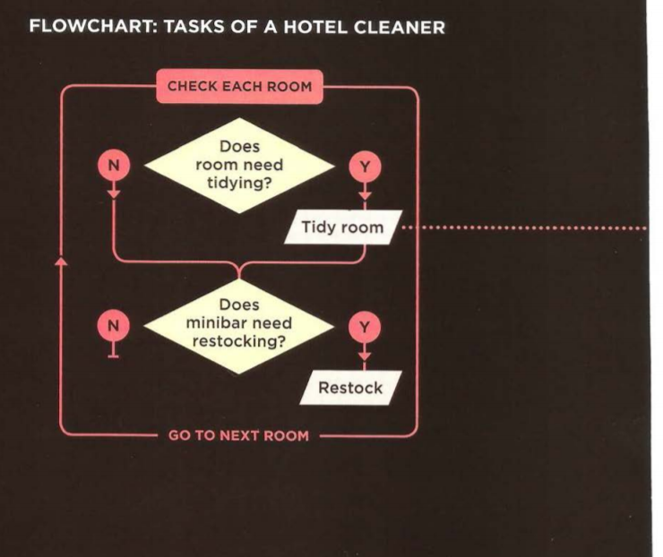
 
 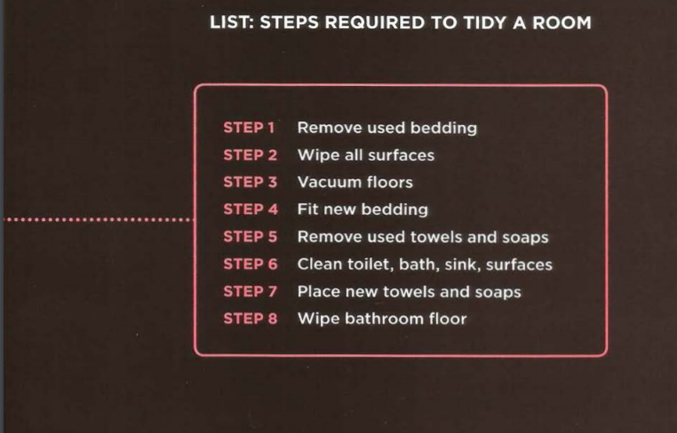
 
 >Each time the script runs, it might only use a subset of all the instructions.

 >Computers approach tasks in a different way than humans, so your instructions must let the computer solve the task prggrammatically.
 
> To approach writing a script, break down your goal into a series of tasks and then work out each step needed to complete that task (a flowchart can help). 
 
 # How Do Computers Fit In With The World Around Them
 
 ### COMPUTERS CREATE MODELS OF THE WORLD USING DATA
 
 
 ## OBJECTS (THINGS)
 In computer programming, each physical thing in the world can be represented as an object.
 
 #### Each object can have its own:
• Properties
• Events
• Methods
 
 PROPERTIES (CHARACTERISTICS)
Each property has a name and a value, and each of these name/value pairs tells you something about each individual instance of the object. 

 
 # EVENTS
In the real world, people interact with objects. These interactions can change the values of the properties in these objects. 
 
 #### WHAT DOES AN EVENT DO? 
 Programmers choose which events they respond to. When a specific event happens, that event can be used to trigger a specific section of the code. 
 Scripts often use different events to trigger different types of functionality. 
 So a script will state which events the programmer wants to respond to, and what part of the script should be run when each of those events occur. 
 
 # METHODS
Methods represent things people need to do with objects. They can retrieve or update the values of an object's properties. 
 
 #### WHAT DOES A METHOD DO? 
 The code for a method can contain lots of instructions that together represent one task. When you use a method, 
 you do not always need to know how it achieves its task; you just need to know how to ask the question and how
 to interpret any answers it gives you.
 
 
 # HOW HTML, CSS,& JAVASCRIPT FIT TOGETHER
 
 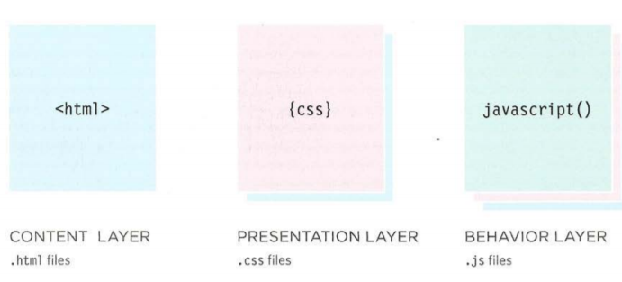
 This is where the content of                         The CSS enhances the HTML page with rules that state               This is where we can change how the page 
the page lives. The HTML gives                        how the HTML content is presented (backgrounds,borders,            behaves, adding interactivity. We will aim to keep as   
the page structure and adds semantics.                 box dimensions, colors, fonts, etc.).                             much of our JavaScript as possible in separate files.
 
 
 
 

 
 
 
 
 
 
